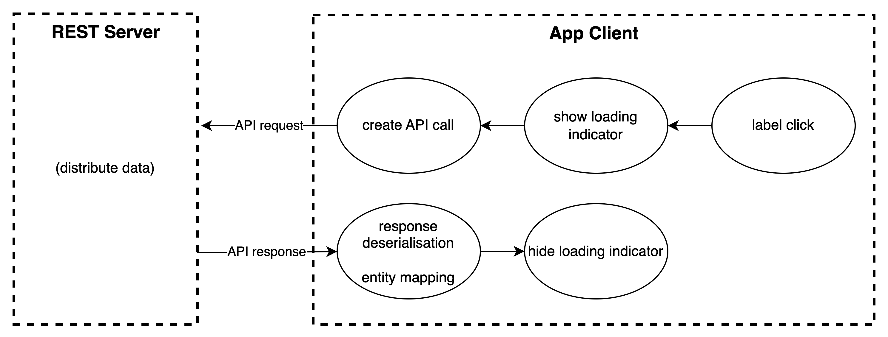
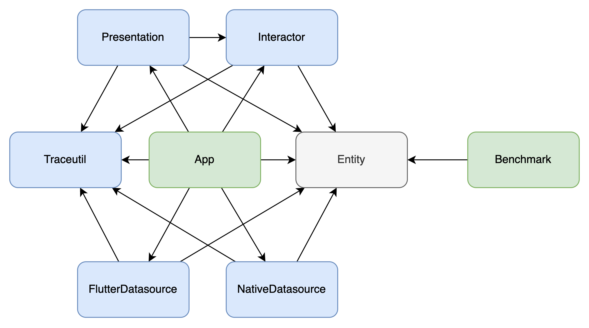
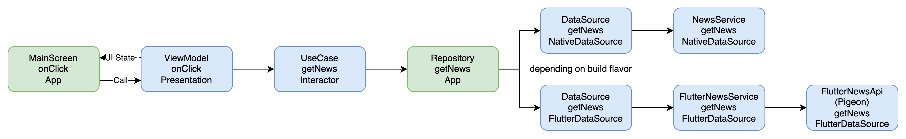
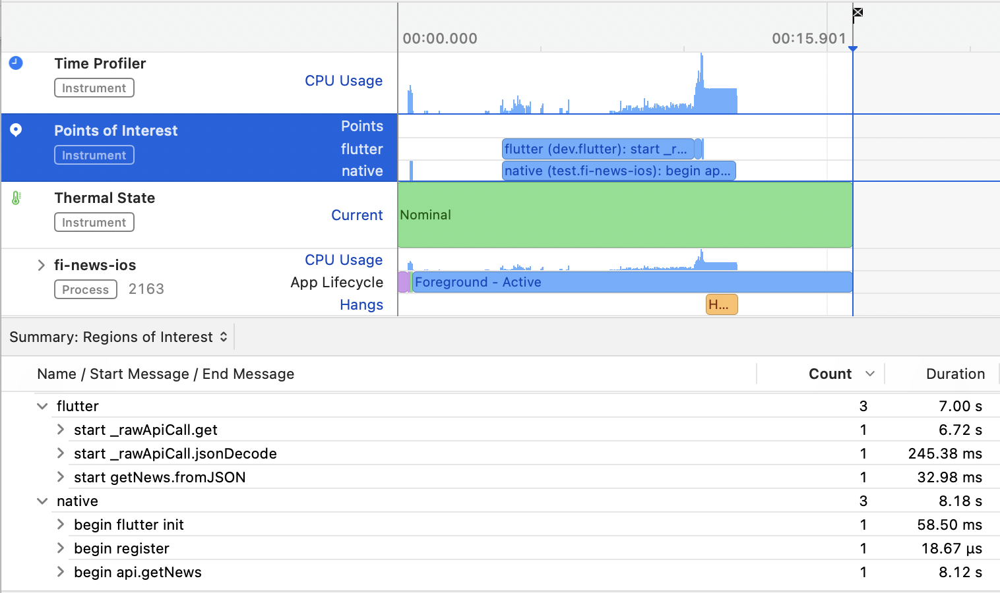
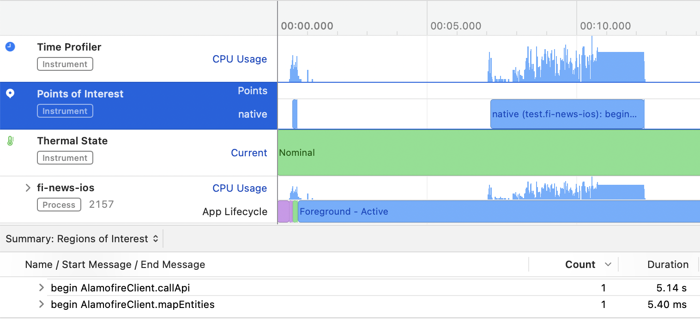

= Vergleichbares App Performance Testing unter Android und iOS mit Flutter-Modulen
Markus Reinhold
:sectnums:
:toc: 
:table-stripes: even
:figure-caption!:
:table-caption!:

:xref1: A Comparison of Performance and Looks Between Flutter and Native Applications, +
https://www.diva-portal.org/smash/get/diva2:1442804/FULLTEXT01.pdf, +
Abgerufen 2023-02-12

:xref2: Key Attributes for a Quality Mobile Application, +
https://ieeexplore.ieee.org/document/9058278/", +
Abgerufen 2023-03-05

:xref3: Zahra, S., Khalid, A., & Javed, A. (2013). An efficient and effective new generation objective quality model for mobile applications. International Journal of Modern Education and Computer Science, 5(4), 36.

:xref4: Animations in Cross-Platform Mobile Applications: An Evaluation of Tools, Metrics and Performance, +
https://www.mdpi.com/1424-8220/19/9/2081", +
Abgerufen 2023-02-25

:xref5: Martin, R. C. (2017). Clean architecture.

:cit1: Flutter 1.12.13 release notes, Add-to-App, +
https://docs.flutter.dev/development/tools/sdk/release-notes/release-notes-1.12.13#add-to-app-feature, +
Abgerufen 2023-03-06

:cit2: Android Core App quality checklist, +
https://developer.android.com/docs/quality-guidelines/core-app-quality, +
Abgerufen 2023-03-06

:cit3: Planning your iOS App, best practices, +
https://developer.apple.com/ios/planning/#adopt-best-practices, +
Abgerufen 2023-03-06

:cit4: Flutter Versus Other Mobile Development Frameworks: A UI And Performance Experiment. Part 2, +
https://web.archive.org/web/20221005043739/https://blog.codemagic.io/flutter-vs-android-ios-xamarin-reactnative/, +
Abgerufen 2023-02-12

:imgTestCase: Abbildung 1
:imgAndArch: Abbildung 2
:imgAndCallTree: Abbildung 3
:tabAndArch: Tabelle 1

== Glossar
Kotlin:: Programmiersprache von JetBrains, seit 2019 Standard-Programmiersprache für Android-Apps footnote:[https://kotlinlang.org/docs/android-overview.html, abgerufen 2023-03-27]
Swift:: Programmiersprache von Apple, verwendet um Programme für Apple-Geräte zu schreiben footnote:[https://www.apple.com/de/swift/, abgerufen 2023-03-27]
Dart:: Programmiersprache, deren Programme mit Hilfe der Dart Engine auf verschiedenen Architekturen ausgeführt werden können footnote:[https://dart.dev/overview, abgerufen 2023-03-27]
Flutter:: Toolkit für Benutzeroberflächen von plattformunabhängigen Projekte in der Programmiersprache Dart footnote:[https://docs.flutter.dev/resources/faq, abgerufen 2023-03-27]
Gradle:: Build Tool für u.a. Android-Projekte footnote:[https://developer.android.com/studio/build/gradle-tips, abgerufen 2023-03-27]
Coroutine:: (hier im Kontext von Kotlin) Konstrukt zum asynchronen Aufruf von Programmcode ohne Bindung an einen bestimmten Thread footnote:[https://kotlinlang.org/docs/coroutines-basics.html, abgerufen 2023-03-28]
Screen:: aktuelles Navigationsziel einer App, geöffnete Ansicht
ViewModel:: (im Kontext von Android) eine mögliches Architektur, um die Logik eines Screens und dessen aktuellen Status zu handhaben footnote:[https://developer.android.com/topic/libraries/architecture/viewmodel, abgerufen 2023-03-28]
Compose:: UI-Framework von Google zur Erstellung von modernen Benutzeroberflächen footnote:[https://developer.android.com/jetpack/compose, abgerufen 2023-03-28]

== Motivation
Android iOS 

=== Verschiedene App-Architekturen

Traditionell werden Applikationen für die Betriebssysteme Android und iOS "nativ", das heißt mit den von den Herstellern bereitgestellten Programmiersprachen und Entwicklungsumgebungen, entwickelt. Diese Art der Implementierung wird generell als qualitativ hochwertig angesehen, da die betriebssystemspezifischen Eigenheiten (bspw. Navigationskonzept oder Umgang mit Systemfunktionen) von den Entwicklern nach den Richtlinien der jeweiligen Betriebssystemhersteller umgesetzt werden. Somit fühlt sich eine App "wie für das Betriebssystem gemacht" an. In den meisten Fällen werden Apps nicht nur für ein Betriebssystem konzipiert, sondern müssen sowohl auf Android- als auch iOS-Geräten lauffähig sein. Dies bedeutet im nativen Kontext den doppelten Entwicklungsaufwand bei praktisch gleichem Endergebnis. Gerade bei kleinen Projekten für einen übersichtlichen Markt ist der Gedanke naheliegend, die gleiche Codebasis für beide Betriebssysteme zu verwenden und einen Kompromiss zwischen Individuallösungen und Kosten / Entwicklungszeit einzugehen. Dieser Ansatz wird als "Cross-Platform" bezeichnet und nutzt meist von den Betriebssystemherstellern unabhängige Sprachen und Programmierumgebungen.
 
 
traditionell native android / ios apps
doppelter Aufwand für nahezu gleiches ergebnis
verschiedene cross platform optionen 
(paper, welches generell mal alles angeschaut hat)

normalerweise schon app vorhanden

Eine komplette Neuentwicklung einer bestehenden App ist aber nicht nur Zeit- und kostenaufwändig, vielmehr müssen die existierenden Apps parallel weiterhin unterstützt werden, um eine gleichbleibende Qualität für die Benutzer zu bieten. Weiterhin ist es ein großes Risiko, die Funktionalität einer bestehenden App in eine neuen Architektur zu portieren und schlimmstenfalls eine schlechtere Qualität als die der ursprünglichen App zu bekommen. Eine schrittweise Aktualisierung einzelner Features erscheint da sinnvoller.

Mit der Version 1.12.13 des Flutter SDKs in 2019 wurde unter anderem das sogenannte Add-to-App Feature vorgestellt footnote:addtoapp[{cit1}]. Mit diesem ist es möglich, ein Flutter-Modul in eine bestehende Android- oder iOS App zu integrieren. Somit ist eine schrittweise Aktualisierung der Apps von der Ersetzung einzelner Features hin zu einer reinen Flutter-App prinzipiell technisch möglich. Es stellt sich jedoch die Frage, für welche Apps sich ein Umstieg zu Flutter lohnt und wo die Schnittstellen zwischen Flutter- und nativem Quellcode am sinnvollsten sind.

=== Softwarequalität für mobile Applikationen

wie kann man die Qualität messen?
Um zu entscheiden, ob sich generell der Einsatz eines anderen Frameworks wie bspw. Flutter im Vergleich zur nativen Implementierung lohnt, stellt sich zunächst das Hindernis, wie die App-Qualität untersucht werden kann. Dazu werden die offiziellen Richtlinien von Android und iOS in den Kontext von zwei weiteren Qualitätsmodellen für mobile Applikationen gesetzt.

.Teilgebiete der Softwarequalität für mobile Applikationen
[grid=rows]
,===
,Android Guidelines footnote:andQua[{cit2}],iOS Best Practices footnote:iosQua[{cit3}],Key Attributes for a Quality Mobile Application footnote:attrQA[{xref2}],An Efficient and Effective New Generation Objective Quality Model for Mobile Applications footnote:OqmMA[{xref3}]

(1) App benutzt Systemressourcen in sinnvollem Maße,"Performance & Stability + 
Functionality",Optimize Performance,Productivity,"Efficiency (battery power, memory)" 

"(2) Benutzung nativer UIs, Bedienkonzepte, Services",Functionality,"Assemble your UI from standard views + 
Human Interface Guidelines","Convenience + 
Ease of Use","Adaptability + 
Usability"

"(3) Daten werden vor unauthorisiertem Zugriff geschützt",Security,Secure Data,Security,Security

(4) Für eine Aufgabe werden die sinnvollsten und simpelsten Methoden verwendet,Functionality,Human Interface Guidelines,"Ease of Use + 
Productivity","Suitability + 
Usability"

"(5) App lässt sich über App Stores aktualisieren, hält dessen Standards ein",Google Play,App Store Guidelines,"Adaptability + 
Convenience","Extensibility + 
Maintainability"

"(6) Daten überleben Pause, Neustart, Rotation der App",Visual Experience,-,Information Perisitence,Data Integrity

"(7) Unterstützt mehrere Gerätemodelle, auch in Zukunft",-,"Build for multiple platforms + 
Automatic Layout",Flexibility,"Portability + 
Maintainability"

"(8) Anpassung an verschiedene Regionen, Kulturen, Einschränkungen",Visual Experience,"Accessibility + 
Inclusion
Internationalize",-,-

(9) Privatsphäre der Nutzerdaten,Privacy,Protect Privacy,-,-

(10) Debugging und Testen für robusten Code,(Checkliste abarbeiten),Test,-,-

(11) App erfüllt die Anforderungen der User,-,-,-,Functionality

(12) Nutzen von verschiedenen Geschäftsmodellen,-,Choose Business model,-,-
,===

Es konnten 12 verschiedene Teilgebiete der Qualität ermittelt werden, von denen die ersten 5 in allen vier Quellen eine Relevanz haben, unter anderem die Performance der App. Zweifelsohne kann die Qualität einer App nicht nur von der Performance abgeleitet werden, aber eine sinnvolle Nutzung der Ressourcen von Mobilgeräten ist integral für das Qualitätsgefühl der App beim späteren Kunde:

* eine geringe CPU-Auslastung führt zu weniger Abwärme beim Benutzen der App und eine bessere Akkulaufzeit
* durch weniger Speicherverbrauch können mehr Apps parallel geöffnet und benutzt werden und einzelne Apps laden schneller, wenn sie gestartet werden

=== Performance Profiling in Cross-Platform-Szenarien

Aus diesem Grund soll sich vorrangig mit dem Vergleich der Performance zwischen Flutter und nativen Apps auseinandergesetzt werden. Es existieren bereits einige Vergleiche zwischen der Performance von nativen Apps und Cross-Plattform-Apps mit verschiedenen Technologien, welche im folgenden nach den benutzten Tools und den erzielten Ergebnissen untersucht werden. 

_A Comparison of Performance and Looks Between Flutter and Native Applications_ footnote:flutterPerf[{xref1}] vergleichen Android, iOS und Flutter in Bezug auf die App Performance, Die Komplexität des Quellcodes und das Look&Feel der resultierenden Apps. Dazu wurde ein App-Konzept jeweils nativ in Kotlin (Android), Swift (iOS) und Flutter implementiert und die resultierenden Apps auf den jeweiligen Plattformen miteinander verglichen. Die CPU-Auslastung wurde manuell auf beiden Plattformen gemessen und dann die jeweilige Flutter-App mit der nativen App verglichen. Es konnte kein nennenswerter Unterschied in der Performance festgestellt werden. Die Qualität des UIs in den beiden Android-Apps wurde aus einer Umfrage ermittelt, die iOS Apps wurden nicht verglichen. Die Automatisierung von Performance- und UI-Tests wurde für die potentielle Verbesserung der Messergebnisse vorgeschlagen.

In _Flutter Versus Other Mobile Development Frameworks: A UI And Performance Experiment. Part 2_ footnote:crossPerf[{cit4}]  wurde ebenfalls die CPU-Auslastung zwischen Flutter, Android, iOS, Xamarin und React Native verglichen. Zudem wurden auch funktional gleiche Apps komplett in den verschiedenen Plattformen implementiert. Flutter schnitt bei den manuellen Tests in Android besser als die native Implementation ab.

_Animations in Cross-Platform Mobile Applications: An Evaluation of Tools, Metrics and Performance_ footnote:crossAnim[{xref4}] testet Animationen in den Plattformen Android und iOS jeweils nativ und mit den Frameworks Xamarin, React Native und Ionic getestet. Flutter war kein Teil der Tests, aber die manuellen Testdurchläufe wurden detailliert beschrieben und können als Grundlage für eigene Tests verwendet werden.

Tabelle 2 listet die benutzten Tools der verschiedenen verwandten Arbeiten. Der Profiler von Android Studio und die Instruments-Umgebung von XCode sind in allen drei Versuchen verwendet worden. Nennenswert ist hierbei auch, dass alle Tests mit dedizierten Flutter-Apps durchgeführt wurden und die Einbindung von Flutter-Modulen in bestehende Apps keine Beachtung gefunden hat. Zudem erfolgte die Testausführung immer manuell und mit vergleichweise geringen Wiederholungen, um robustere Ergebnisse zu erhalten.

.verwendete Tools zum Profiling auf den Plattformen Android und iOS
,===
,footnote:flutterPerf[{xref1}] (2020),footnote:crossPerf[{cit4}] (2019),footnote:crossAnim[{xref4}] (2019)

Android CPU Usage,Android Studio Profiler,Android Studio Profiler,Android Studio Profiler
Android Memory Usage,-,-,Android Studio Profiler
Android FPS,-,-,adb systrace
Android GPU Memory,-,-,adb dumpsys
iOS CPU Usage,Instruments,-,Instruments: Core Animation
iOS Memory Usage,-,-,Instruments: VM Tracker
iOS FPS,-,-,Instruments: Time Profiler
iOS GPU Memory,-,-,-
,===

=== Ziel

RQ1:: Welche Tools und Methoden existieren zum Performance Profiling auf den Plattformen Android und iOS und für Flutter-Module?
RQ2:: Welche Performance-Metriken können auf beiden Plattformen und im Kontext von Flutter-Modulen erfasst werden?
RQ3:: Wie können die Daten aufbereitet und in ein einheitliches Format zur Weiterverarbeitung überführt werden?

== Grundlagen
=== Performance Profiling

bestimmte profile versionen erstellt
- nahezu identisch mit release version
- flutter wird kompiliert und nicht im JIT Modus ausgeführt

==== Profiler und deren Metriken
==== macro / microbenchmarks
=== Instrumented Tests, UI Tests

Ein in Android und iOS oft benutzter Weg, um die späteren Untersuchungen systematisch und wiederholbar auf verschiedenen Testgeräten durchzuführen, sind sogenannte _Instrumented Tests_. Diese werden dem Projekt in gesonderten Ordner- oder Paketstrukturen hinterlegt und von Android Studio und XCode unterstützt.
- damit kann Flutter Engine 

Fluter bietet über die integrierten _Dev Tools_ ebenfalls Möglichkeiten, verschiedene Performance-Metriken darzustellen und auszuwerten. footnote:fluttDevTools[https://docs.flutter.dev/perf/ui-performance, abgerufen 2023-03-01], Integration Tests für Performance Profiling sind ebenfalls möglich 

=== Einbindung von Flutter-Modulen

==== Integration in eine Android-App
gradle script

- komplett ohne UI
- als Activity
- als Fragment
- custom View

die ausführliche Anleitung

Die Einbindung von Android UI-Elementen innerhalb eines Flutter UIs ist ebenfalls möglich footnote:androidView[https://docs.flutter.dev/development/platform-integration/android/platform-views, abgerufen 2023-03-04].

==== Integration in eine iOS-App
cocapod

Die Einbindung von iOS UI-Elementen innerhalb eines Flutter UIs ist ebenfalls möglich footnote:iOSview[https://docs.flutter.dev/development/platform-integration/ios/platform-views, abgerufen 2023-03-04].

==== Kommunikation zwischen Flutter und der Host-Plattform

Das Flutter Framework stellt sogenannte _Platform Channels_ footnote:PlatChan[https://docs.flutter.dev/development/platform-integration/platform-channels, abgerufen 2023-03-04] zur Kommunikation zwischen der Flutter Engine und dem jeweiligen Host her. Die Nachrichten werden binär serialisiert und primitive Datentypen sind standardmäßig unterstützt. Dem Entwickler stehen folgende Arten von Channels zur Verfügung:

MethodChannel:: Methodenname und Parameter werden gesendet und Rückgabewerte können empfangen werden (Methode muss zuvor implementiert werden)
EventChannel:: Ein Stream von Events kann abonniert werden
BasicMessageChannel:: Daten in eigenem Format (bspw. JSON) können gesendet und Rückgabewerte empfangen werden

Alle Channels können sowohl in Richtung Flutter > Host als auch Host > Flutter implementiert werden. Obwohl das Konzept von Datentypen in Channels beachtet wird, sind diese nicht typsicher (weder in Parameterreihenfolge noch Nullability). Um diese Funktionalität zu erhalten, kann das Flutter-Plugin _Pigeon_ footnote:pigeon[https://pub.dev/packages/pigeon, abgerufen 2023-03-04] verwendet werden, welches offiziell von Flutter unterstützt wird. Mithilfe des Plugins können Schnittstellen zwischen Flutter und Hostplattformen durch code generation erstellt werden. Der generierte Quellcode muss schließlich nur noch in die Projekte der jeweiligen Plattformen eingebunden werden.

Wichtig beim Aufrufen der Kommunikationsschnittstelle egal welcher Art ist, dass dies nur im UI Thread (Android) bzw. Main Thread (iOS) geschehen darf. Intern werden diese Aufrufe schließlich asynchron behandelt. 

Eine weitere Möglichkeit bietet das _ffi_-Plugin footnote:ffi[https://dart.dev/guides/libraries/c-interop, abgerufen 2023-03-04], welches den Aufruf von Funktionen aus C-Bibliotheken auf dem Host ermöglicht. Der Aufruf von Dart-Methoden aus Richtung des Hosts ist damit jedoch nicht möglich, weswegen das Plugin nicht für die geplanten Einsatzgebiete für Flutter-Module relevant ist. 

== Versuchsaufbau
Die Nutzbarkeit der gefundenen Methoden zum Performance Profiling soll mit einem Versuch erprobt werden.
zwei apps erstellt
flutter modul
eingebunden
Mockoon für folgenden Datensatz: 

{imgTestCase} illustriert den schematischen Ablauf des Tests. Bei Klick auf ein Download-Label in der App soll eine Anfrage an einen Rest-Server erstellt und gesendet werden, welcher daraufhin mit einem JSON-Payload antwortet. Dieser muss von der App zunächst in Objekte der jeweiligen Programmiersprache deserialisiert werden und wird daraufhin einem weiteren Mapping unterzogen, welches die Daten im API-Format in ein generelleres Format für die App umwandelt. Dies hat den Vorteil, dass das API Model unabhängig von der Logik der App verändert werden und zudem fehlerhafte Rückgabewerte an dieser Stelle behandelt werden können footnote:[https://developer.android.com/topic/architecture/data-layer?continue=https%3A%2F%2Fdeveloper.android.com%2Fcourses%2Fpathways%2Fandroid-architecture%23article-https%3A%2F%2Fdeveloper.android.com%2Ftopic%2Farchitecture%2Fdata-layer#business-models, abgerufen 2023-03-29].

.{imgTestCase}: Bestandteile des Versuchsaufbaus und deren Verbindungen zueinander

Für den Versuch werden neben dem REST-Server jeweils eine App für Android- und iOS-Geräte erstellt und in diese der Aufruf zur REST-API sowohl mit einer nativen Bibliothek als auch über ein Flutter-Modul implementiert. Alle im folgenden beschriebenen Programme und Tools sind in den jeweils angegebenen Versionen auf einem _Macbook Pro 2021 M1 Pro_ mit _macOS 12.6_ Betriebssystem ausgeführt bzw. kompiliert.

=== REST-Server

Als Ausgangspunkt wurde eine JSON Datei mit 750.000 Objekten erstellt, damit eine sichtbare Last während der Verarbeitung der Daten in den Apps entsteht. Ein einzelnes Objekt stellt dabei einen fiktiven Eintrag eines Newstickers dar, wobei dieser nur aus einem Titel mit einer zufällig generierten Sequenz von fünf Ziffern besteht.

.Beispieldaten des lokalen REST-Servers
[source,json]
----
[
  {
    "title": "26304"
  },
  {
    "title": "86258"
  },
  {
    "title": "91582"
  },

  [...]

]
----

Um den Inhalt dieser Datei als Rückgabewert von einer REST-API bereitstellen zu können, wird das Programm Mockoon footnote:[https://mockoon.com/ abgerufen 2023-03-27] verwendet. Mit diesem kann unter anderem ein lokaler REST-Server gestartet und darin Routen mit entsprechenden Rückgabewerten erstellt werden. Zuerst wurde mit der dynamischen Generierung von Testdaten experimentiert, aber dieser Ansatz war sowohl langsam als auch nichtdeterministisch, weswegen sich für einen statischen Datensatz entschieden wurde.

=== Flutter Modul

Das verwendete Flutter Modul wurde manuell (ohne Benutzung des Plugins für Android Studio) anhand der offiziellen Dokumentation und mit der Flutter-Version _3.7.7_ erstellt footnote:[https://docs.flutter.dev/development/add-to-app/android/project-setup#manual-integration, abgerufen 2023-03-29]. 

Für die Kommunikation mit der REST API wird die `http` Bibliothek von Flutter verwendet, welche Teil der offiziellen Dart-Bibliotheken ist footnote:[https://pub.dev/packages/http, abgerufen 2023-03-29]. Die Funktion `_rawApiCall` ist dabei eine Generalisierung von API-Aufrufen an den REST Server und gibt ein generisches JSON-Objekt als `Map<String, dynamic>` zurück. Eine Behandlung möglicher Netzwerkfehler wurde an dieser Stelle noch nicht implementiert.

.APi call 
[source, Dart]
----
class ApiService {
    // Android Emulator and iOS Simulator have different local network configurations
    // change this to the local host machine address when testing with a real device
    final baseUrl =
        Platform.isAndroid ? "http://10.0.2.2:3001/" : "http://0.0.0.0:3001/";

    dynamic _rawApiCall(String endpoint) async {
        try {
            final response = await get(Uri.parse(baseUrl + endpoint));
            final json = jsonDecode(response.body);
            return json;
        } catch (e) {
            print(e.toString()); // TODO error handling
            return null;
        }
    }

    dynamic getNews() async {
        return _rawApiCall("news");
    }
}
----

Damit die Antwort der API auch an das jeweilige Host-System zurückgegeben werden kann muss zuerst die Schnittstelle der zuvor erwähnten Bibliothek _Pigeon_ definiert werden, aus der die eigentlichen `MessageChannel`-Implementationen generiert werden. In dieser wird der für den Testfall relevante Aufruf `getNews` definiert, welcher eine Liste von serialisierbaren `ApiNewsEntity` Objekten zurückgibt. Diese Funktion wird mit der Annotation @async gekennzeichnet, welche ebenfalls von Pigeon stammt und der Funktion auf den Host-Plattformen einen Callback Handler hinzufügt. Somit kann in diesem Fall die REST API aufgerufen werden ohne währenddessen das Programm zu blockieren. 

.definierte Pigeon-Schnittstelle
[source, Dart]
----
class FlutterApiNewsEntity {
  String? title;
}

@FlutterApi()
abstract class FlutterNewsApi {
  @async
  List<FlutterApiNewsEntity> getNews();
}
----

Als Verbindung zwischen dem REST Client und Pigeon steht schließlich die `NewsApi`-Klasse, welche die von Pigeon generierte FlutterNewsApi implementiert und beim Aufruf von `getNews` die Daten vom Service abruft. Außerdem geschieht hier das Mapping vom API Model zum eigentlichen Datenmodell in Flutter.

.Implementierung der Pigeon API mit mapping
[source, Dart]
----
class NewsApi implements FlutterNewsApi {
    final ApiService _api = ApiService();

    @override
    Future<List<FlutterApiNewsEntity?>> getNews() async {
        final jsonNews = await _api.getNews();
        if (jsonNews == null) return [];

        // Umwandlung von JSON- zu Dart-Objekt erfolgt hier manuell
        return (jsonNews as List<dynamic>).map((e) => fromJSON(e)).toList();
    }
}

FlutterApiNewsEntity fromJSON(Map json) {
  return FlutterApiNewsEntity(title: json["title"]);
}
----

Schlussendlich wird die API in der `main`-Methode der Dart-Programms initialisiert und zudem noch eine Debug Nachricht über den aktuellen Build-Typ ausgegeben. Ein Aufruf von `runApp()`, wie bei Flutter-Apps üblich, wird an dieser Stelle nicht benötigt, da kein UI angezeigt werden soll.

.Einstiegspunkt in das Flutter-Modul
[source, Dart]
----
void main() {
  String buildMode = kReleaseMode ? "release" : kProfileMode ? "profile" : "debug";
  print("Flutter running in $buildMode mode.");

  FlutterNewsApi.setup(NewsApi());
}
----

Falls das Flutter-Modul in eine iOS App eingebunden wird kann mit Hilfe der Bibliothek _signposts_ ein nativer Aufruf der iOS API _os_signpost_ erfolgen, welche wiederum die Ausführungszeiten der jeweiligen Codestellen in einem Performance Profiling anzeigt footnote:[https://github.com/gaaclarke/signposts, abgerufen 2023-03-29]. Es wurde leider keine vergleichbare Bibliothek für Android Hostsysteme gefunden, weswegen die Messungen auch nicht in den vorangegangenen Listings zu finden sind.

.Exemplarischer Signpost für iOS für das Mapping von JSON zum Datenmodell im Flutter-Modul
[source, Dart]
----
signposts.Interval interval = signposts.Interval('start getNews.fromJSON');
final news = (jsonNews as List<dynamic>).map((e) => fromJSON(e)).toList();
interval.end('end getNews.fromJSON');
----

=== Android App

Für die Erstellung der Android App wurde das Programm _Android Studio_ in der Version _2022.3.1 Canary 5_ verwendet, welches die offizielle Entwicklungsumgebung für Android darstellt footnote:[https://developer.android.com/studio/, abgerufen 2023-03-27]. Es wurde sich bewusst für eine Canary Version der IDE entschieden, da einige Profiling Tools in der derzeit aktuellen Stable-Version _2021.3_ nicht erwartungsgemäß funktionierten. Da der Autor Vorerfahrung in der Android-Entwicklung aufweist, wurde eine App-Architektur über ein Minimalbeispiel zur Integration von Flutter-Modulen hinaus erstellt. Hintergrund ist das Testen der Performance in realeren Bedingungen und der Test der Einbindung von Flutter-Modulen in bestehende Applikationen.

==== Modularisierung und Build Flavors
Android Studio erstellt App Versionen für das Performance Profiling nicht automatisch wenn ein neues Projekt angelegt wird, sondern es muss ein eigener Profile Build type erstellt werden footnote:[https://developer.android.com/studio/profile, abgerufen 2023-03-22]. Um den Code des Flutter-Moduls möglichst sauber von der nativen Implementation zu trennen wurde der Ansatz über sogenannte Build Flavors footnote:[https://developer.android.com/studio/build/build-variants, abgerufen 2023-03-27] gewählt. Mit diesen können einzelne Abhängigkeiten für die Kompilierung (de-)aktiviert werden. Somit wird ausgeschlossen, dass Code des jeweils inaktiven Moduls die zu testende App beeinflusst während der geteilte Code uneingeschränkt wiederverwendet werden kann. 

Ebenfalls nicht standardmäßig enthalten ist eine Möglichkeit, das Performance Profiling zu automatisieren. die Macrobenchmark-Bibliothek kann dazu verwendet werden, UI-Interaktionen mit einer App, bspw. die Startup-Phase, Klicks oder Scrolls, auszuwerten. Dazu benötigt es ein neues Modul, was die UI-Tests beinhaltet und dem Projekt mit wenigen Klicks hinzugefügt werden kann footnote:[https://developer.android.com/topic/performance/benchmarking/macrobenchmark-overview#setup-macrobenchmark, abgerufen 2023-03-27].

NOTE: schwache Argumentation

Um insbesondere den Code zur Messung der Performance für möglichst viele Tests verwenden zu können und weil der Autor in diesem Bereis bereits hinreichende Erfahrung gesammelt hat wurde sich dafür entschieden, eine App-Struktur auf Basis von Clean Architecture footnote:[{xref5}] zu verwenden. Umgesetzt wird diese mit Hilfe von Gradle-Modulen, welche für die logische Unterteilung des Quellcodes und die Erstellung individueller Abhängigkeiten verwendet werden können. Dieser Ansatz wird im Android-Ökosystem oft als _Multi-Module_ oder _Modularization_ bezeichnet footnote:[https://developer.android.com/topic/modularization/patterns, abgerufen 2023-03-27]. Die eindeutige Unterteilung des Quellcodes anhand dessen Aufgaben soll die Wiederverwendbarkeit für weitere Performance Tests erheblich erhöhen und vor allem die Integration des Flutter-Moduls unter realeren Bedingungen ermöglichen.

{imgAndArch} visualisiert die Abhängigkeiten der erstellten Android-Module. Grüne Module repräsentieren Android Module, welche eine App oder einen UI Test erzeugen können. Blaue Module kennzeichnen Android-Bibliotheken, welche Zugriff auf Funktionen des Android SDKs haben und die Unterteilung in verschiedene Aufgaben widerspiegeln (Clean Architecture). Das graue Entity-Modul beinhaltet gemeinsam genutzte Business Logik und hat keine Abhängigkeiten zum Android-Ökosystem. In {tabAndArch} werden die Aufgaben der vorgestellten Module jeweils aufgeschlüsselt.

.{imgAndArch}: Modulstruktur der Android App

.{tabAndArch}: Inhalt der Module
,===
Modulname,Aufgabe

Entity,Business-Logic und Entities, derzeit nur die NewsEntity
App,Android-Modul mit allen App-relevanten Dateien; UI; verbindet alle anderen Module miteinander
Interactor,Repositories; Use Cases und die Navigation
Presentation, ViewModels als Datenquelle für das UI
FlutterDatasource, Einbindung des Flutter-Moduls
NativeDatasource, Implementation des nativen API-Calls 
Benchmark, Modul für UI Tests
Traceutil, Hilfsmodul um Tracing-Funktionen vereinheitlicht anderen Modulen bereitzustellen
,===

==== Dependency Injection und Hilfsklassen

NOTE: TODO

hilt als DI, footnote:[https://developer.android.com/training/dependency-injection/hilt-android, abgerufen 2023-03-29]

hilt application class ist nicht kompatibel mit microbenchmark, da `Application` Klasse eine `@HiltApplication` Annotation benötigt, welche dem microbenchmark aber nicht hinzugefügt werden kann footnote:[https://issuetracker.google.com/issues/258256854, abgerufen 2023-03-29]

Des Weiteren wurde eine `AppResult`-Klasse als generischer Wrapper für Rückgabewerte hinzugefügt. Eine Funktion kann so bspw. den Rückgabewert `AppResult<String>` besitzen und entweder einen validen String als `AppResult.Success(String)` oder im Fehlerfall die entsprechende Meldung als `AppResult.Error(ErrorReason)` zurückliefern footnote:[https://developer.android.com/topic/architecture/data-layer?continue=https%3A%2F%2Fdeveloper.android.com%2Fcourses%2Fpathways%2Fandroid-architecture%23article-https%3A%2F%2Fdeveloper.android.com%2Ftopic%2Farchitecture%2Fdata-layer#expose-errors, abgerufen 2023-03-29].

==== Kommunikation mit der Rest-API

Innerhalb der folgenden Quellcode-Ausschnitte wird die Funktion `traceAsync` verwendet, welche von der durch das Paket `androidx.core.os` bereitgestellten Funktion `trace` adaptiert wurde und die Messung der Ausführungszeit von Coroutinen ermöglicht. Als eindeutige Identifizierung (_Cookie_) zur Unterscheidung von mehreren gleichzeitig laufenden Messungen desselben Namens wird hier die aktuelle Systemzeit verwendet, wenn nicht anders angegeben.

.traceAsync Funktion zur Messung der Ausführungszeit von Coroutinen
[source, Java]
----
inline fun <T> traceAsync(
    sectionName: String,
    cookie: Int = System.currentTimeMillis().toInt(),
    block: () -> T
): T {
    Trace.beginAsyncSection(sectionName, cookie)
    try {
        return block()
    } finally {
        Trace.endAsyncSection(sectionName, cookie)
    }
}
----

Der Aufruf der von _Pigeon_ generierten `api` wird innerhalb eines `Services` gekapselt. Dies hat den Hintergrund, um von einem Callback in einen für Kotlin typischeren asynchronen Aufruf mit Coroutines zu gelangen. In der `DataSource` wird schließlich das von Pigeon bereitgestellte Datenmodell in das App-Eigene `NewsEntry` umgewandelt und gleichzeitig Einträge ohne Titel gefiltert. Kein Teil des Mappings ist bisher ein korrektes Error Handling. Wenn innerhalb des Flutter-Moduls ein Fehler auftritt wird somit eine leere Liste von `NewsEntries` zurückgegeben und eine weitere Fehlerbehandlung ist bisher nicht möglich. 

.Flutter Modul mit API Request an den von Pigeon generierten Code
[source, Java]
----
// FlutterNewsServiceImpl
override suspend fun getNews(): List<FlutterApiNewsEntity> = withContext(Dispatchers.Main) {
    // Umwandlung von Callback in Coroutine
    suspendCoroutine { continuation ->
        api.getNews {
            continuation.resume(it)
        }
    }
}

// FlutterNewsDataSource
override suspend fun getNews(): AppResult<List<NewsEntry>> {
    return AppResult.Success(newsService.getNews().mapNotNull {
        it.title?.let {title ->
            NewsEntry(title) // entity mapping
        }
    })
}
----

Für die Kommunikation mit dem REST-Server in dem nativen Teil der App wurde sich für die Bibliothek _Retrofit_ footnote:[https://github.com/square/retrofit, abgerufen 2023-03-27] entschieden, da der Autor bereits einige Erfahrungen sammeln konnte. Das Interface `NewsService` legt fest, welche Endpunkte verfügbar sind und wie die Rückgabewerte aussehen. Im aktuellen Fall wird eine Liste von `ApiNewsEntry` Objekten erwartet, welche einen optionalen Titel haben. Entries ohne Titel werden auch hier übersprungen und zusätzlich eine Fehlermeldung generiert. Die eigentlichen Anfragen an die API werden in der Funktion `callApi` abstrahiert, welche die Fehlerbehandlung und das Mapping zusammenfasst.

.Host Modul mit API Request
[source, Java]
----
// ApiNewsEntry mit Mapping-Vorschrift
data class ApiNewsEntry(
    val title: String?
): ApiEntity<NewsEntry> {
    override fun toEntity() = when {
        title == null -> mappingError(::title)
        else -> NewsEntry(title)
    }
}

// NewsService 
interfacé NewsService {
    @GET("news") suspend fun getNews(): Response<List<ApiNewsEntry>>
}

// NativeNewsDataSource
override suspend fun getNews() = traceAsync(TraceSection.NATIVE_DS_GET_NEWS.traceName) {
    callApi(
        call = { newsService.getNews() },
        mapper = { it.toEntity() }
    )
}

//CallApi 
suspend fun <ApiModel, EntityModel> callApi(
    call: suspend () -> Response<ApiModel>,
    mapper: (ApiModel) -> EntityModel,
): AppResult<EntityModel> {
    return traceAsync(TraceSection.NATIVE_API_CALL.traceName) {
        try {
            val response = call()
            when {
                response.isSuccessful -> AppResult.Success(response.body()!!).mapSuccess(mapper)
                else -> {
                    AppResult.Error( /* ... */)
                }
            }
        } catch (e: Exception) {
            /* ... */
            AppResult.Error(reason)
        }
    }
}
----

Der Aufruf der API erfolgt indirekt über den `GetNewsUseCase` und das `NewsRepository`. Momentan werden die Daten unverändert zurückgegeben, in komplexeren Szenarien könnten an diesen Stellen aber noch weitere Use Cases und Datenquellen miteinander verbunden werden. Ein wichtiges Detail innerhalb des NewsRepositories ist, dass die `NewsDataSource` als Interface über Hilt injiziert und die jeweilige Implementierung durch die zuvor erwähnten Build Flavors bereitgestellt wird. An dieser Stelle wird folglich je nach Flavor entweder die native oder in Flutter implementierte `DataSource` aufgerufen.

.Use Case und Repository als Platz für zukünftige Erweiterungen
[source, Java]
----
// Use Case
suspend operator fun invoke() = newsRepository.getNews()

// NewsRepositoryImpl
override suspend fun getNews() = traceAsync(TraceSection.REPOSITORY_GET_NEWS.traceName) {
    newsDataSource.getNews()
}
----

Schließlich wird der Use Case mit dem UI verbunden. Um die Logik von der Gestaltung des Screens zu trennen, wird der entsprechende Code in ein sog. `ViewModel` bzw. einen `Screen` aufgeteilt. Das `ViewModel` kommuniziert indirekt über UI States mit dem Screen. Die beiden UI States `Init` und `Loading` werden verwendet um Statusmeldungen vom `ViewModel` aus zum UI senden und dieses entsprechend zu aktualisieren. Bei Interaktion mit dem Screen werden im Umkehrschluss Funktionen des ViewModels aufgerufen, zu sehen bei Klick auf den Download-Knopf. Es wurde sich bewusst für einen klickbaren Text anstelle eines Buttons entschieden, da der Text keine Animation besitzt und somit keine unnötigen Ausgaben im Performance Profiler erzeugt. Der UI State wird über die Funktion `collectAsState` vom aktuellen Screen abonniert und dieser bei jeder Änderung des States automatisch aktualisiert.

.Main Screen mit Verbindung zum ViewModel
[source, Java]
----
@Composable
fun MainScreen(viewModel: MainViewModel) = with(viewModel) {
    val uiState by uiState.collectAsState()
    MainContent(uiState = uiState, onDownloadClick = ::onDownloadClick)
}

@Composable
private fun MainContent(uiState: MainUiState, onDownloadClick: () -> Unit) {
    Surface(/*...*/) {
        Column(/*...*/) {
            Text(
                text = "Download",
                modifier = Modifier.clickable(
                    enabled = uiState !is MainUiState.Loading,
                    /*...*/
                    onClick = onDownloadClick
                )
            )
            
            if (uiState is MainUiState.Loading) Text("downloading...")
        }
    }
}
----

.Click Handler im ViewModel
[source, Java]
----
//MainViewModel
fun onDownloadClick() = viewModelScope.launch {
    traceAsync(TraceSection.MAIN_VM_ON_CLICK.traceName) {
        _uiState.tryEmit(MainUiState.Loading)
        getNewsUseCase()
        _uiState.tryEmit(MainUiState.Init)
    }
}
----

Den kompletten Programmdurchlauf von Beginn bei Klick auf das Textlabel bis hin zum API Call zeigt {imgAndCallTree}. Als zusätzlicher Kontext wurden auch die benutzten Module in den jeweiligen Farben mit abgebildet.

.{imgAndCallTree}: aufgerufene Klassen, Funktionen und beteiligte Module bei Klick auf den Download-Button 

=== iOS App

Im Gegensatz zu Android hat der Autor bisher nur wenig Erfahrung in der Programmierung von iOS Apps. 
autor hat nicht so viel Erfahrung in iOS Programmierung

durch vorherige schwierigkeiten mit di wurde die hier nicht verwendet

XCode 14.2
begonnen mit neuem xcode Projekt, Swift 5, 

Das bestehende Flutter-Modul wurde mit der offiziellen Anleitung in das XCode-Projekt eingebunden footnote:[https://docs.flutter.dev/development/add-to-app/ios/project-setup, abgerufen 2023-03-22]. Dabei wurde der Weg über die Einbindung mit cocoapods, einem Dependency Manager für Swift footnote:[https://cocoapods.org/, abgerufen 2023-03-22], gewählt.

Das Flutter-Modul wird 

Zunächst wurde identisch zur Android-Implementation eine Klasse zur Repräsentation eines einzelnen Artikels der API erstellt.

.App Entity für die Repräsentation eines News-Eintrages
[source, Swift]
----
struct NewsEntry {
    let title: String
}
----

Basierend auf dem automatisch generierten ContentView des SwiftUi-Projektes wurde ein Button zum Start des Downloads und ein Statustext hinzugefügt. Durch die `@State`-Annotation der Variable `isLoading` wird das `View` automatisch neu geladen, wenn sich die Variable ändert.

.UI der Applikation mit Button zum Start des Downloads und Textlabel, welches den Download-Status anzeigt
[source, Swift]
----
struct ContentView: View {
    @State private var isLoading = false
    
    var body: some View {
        VStack {
            Button("Download") {
                callApi()
            }
            if (isLoading) {
                Text("loading...")
            } else {
                Text("finished")
            }
        }
    }
    
    func callApi() {
        isLoading = true
        NewsRepository().callApi(flutter: true) { data in
            isLoading = false
        }
    }
}
----

Eine weitere Klasse ist die NewsRepository, die ähnlich zur Android-App entscheidet, ob die Artikel von der Flutter-API oder der nativen API bereitgestellt werden. Des Weiteren wird eine Callback-Funktion mitgeliefert um die Daten später im UI anzeigen zu können.

.Repository als Entscheidungspunkt für Aufrufe in Flutter oder Swift
[source,Swift]
----
struct NewsRepository {
    func callApi(flutter: Bool, resultHandler: @escaping ([NewsEntry]) -> Void) {
        if (flutter) {
            FlutterDependencies().callApi(resultHandler: resultHandler)
        } else {
            AlamofireClient().callApi(resultHandler: resultHandler)
        }
    }
}
----

Die native Implementation ist über das Alamofire-Paket realisiert. Zuerst wird die API-Response von JSON in ein `ApiNewsEntry`-Objekt deserialisiert, welches einen optionalen Titel beseitzt. Im anschließenden Mapping werden Artikel in die zuvor erläuterte `NewsEntry`-Klasse umgewandelt und Artikel mit fehlendem Titel dabei übersprungen. Zuletzt wird je nach Ausgang des Requests entweder die Liste von `NewsEntry`s oder eine leere Liste zurückgegeben. 

.native Implementation des REST-Clients über Alamofire
[source, Swift]
----
struct ApiNewsEntry: Decodable {
    let title: String?
}

struct AlamofireClient {
    
    var signposter = Signposter()
    
    func callApi(resultHandler: @escaping ([NewsEntry]) -> Void) {
        signposter.beginInterval("AlamofireClient.callApi")
        AF.request("http://192.168.178.39:3001/news", encoding: JSONEncoding.default).responseDecodable(of: [ApiNewsEntry].self) { response in
            signposter.endInterval("AlamofireClient.callApi")
            
            signposter.beginInterval("AlamofireClient.mapEntities")
            let res = response.value?.compactMap { entity in
                // Mapping der Entities, wenn ein Titel vorhanden ist
                if let title = entity.title {
                    return NewsEntry(title: title)
                }
                return nil
            }
            signposter.endInterval("AlamofireClient.mapEntities")
            resultHandler(res ?? [])
        }
    }
}
----

flutter engine erstellt und registriert
in echtem projekt sollte engine wiederverwendet werden
flutter api (pigeon) erstellt
getNEws aufgerufen 
mapping zu internen Datentypen

.Flutter Dependencies mit Signpost-Messungen
[source,Swift]
----
class FlutterDependencies: ObservableObject {
    let signposter: Signposter = Signposter()
    lazy var flutterEngine = FlutterEngine(name: "my flutter engine")
    
    init(){
        signposter.beginInterval("flutter init")
        flutterEngine.run()
        signposter.endInterval("flutter init")
        
        signposter.beginInterval("register")
        GeneratedPluginRegistrant.register(with: self.flutterEngine);
        signposter.endInterval("register")
    }
    
    func callApi(resultHandler: @escaping ([NewsEntry]) -> Void) {
        let api = FlutterNewsApi(binaryMessenger: flutterEngine.binaryMessenger)
        
        signposter.beginInterval("FlutterDependencies.callApi")
        api.getNews(completion: {(data) in
            self.signposter.endInterval("FlutterDependencies.callApi")
            
            self.signposter.beginInterval("FlutterDependencies.mapEntities")
            let res = data.compactMap { entity in
                if let title = entity.title {
                    return NewsEntry(title: title)
                }
                return nil
            }
            self.signposter.endInterval("FlutterDependencies.mapEntities")
            
            resultHandler(res)
        })
    }
}
----

== Ergebnisse

flutter:
unterschiede in android und ios müssen abstrahiert werden (signpost)
generische error klasse noch nicht in pigeon enthalten

android: 

obwohl nur wenig Zeit für Projektsetup in Android viele Probleme

kein error handling in flutter modul serialisiert

macrobenchmarks geben nur systrace zurück, keinen method trace
androidx tracing lib kann helfen, aber nur native

profile build type muss profile heißen!

microbenchmark gibt systrace und callstack sample zurück

ausprobieren von macrobenchmark und microbenchmark

iOS:
learnings bei ios
signpost api geht mit plugin
call stack auch im release build zu sehen

performance profiler würde mehrere signpost aufrufe korrekt filtern und auch averages anzeigen
xctmetrics sind ein guter anfang, aber sign posts müssten angepasst werden

alamofire plugin genutzt

== Ausblick
nicht nur Performance wichtig, sondern auch andere wichtige Metriken 

wie kann softwarequalität sinnvoll und objetiv gemessen werden?
ISO 9126

---

Fragen: 

- Aufbau Projekt (SW Qualität mit rein?)
- Zeitplan
- ASCIIDoc:
* Listings usw richtig verlinken?
* Quellenangabe in wissenschaftlicher Form

matlab, spss,  k means cluster

kapitel schon einleitung abschlussatz