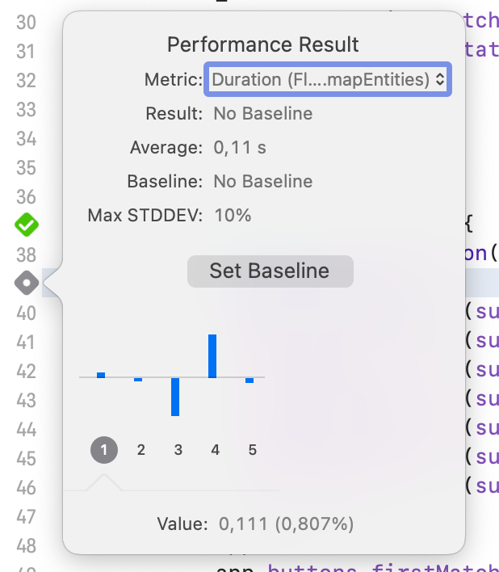

= Vergleichbares App Performance Testing unter Android und iOS mit Flutter-Modulen
Markus Reinhold
:sectnums:
:toc: 
:table-stripes: even
:figure-caption!:
:table-caption!:

:rq1: Welche Tools und Methoden existieren zum Performance Profiling auf den Plattformen Android und iOS und für Flutter-Module?
:rq2: Welche Performance-Metriken können auf beiden Plattformen und im Kontext von Flutter-Modulen erfasst werden?
:rq3: Wie können die Daten aufbereitet und in ein einheitliches Format zur Weiterverarbeitung überführt werden?

:xref1: Olsson, Matilda. "A Comparison of Performance and Looks Between Flutter and Native Applications: When to prefer Flutter over native in mobile application development." (2020).

:xref2: Jain, Parita, Anupam Sharma, and Puneet Kumar Aggarwal. "Key attributes for a quality mobile application." 2020 10th International Conference on Cloud Computing, Data Science & Engineering (Confluence). IEEE, 2020.

:xref3: Zahra, S., Khalid, A., & Javed, A. (2013). An efficient and effective new generation objective quality model for mobile applications. International Journal of Modern Education and Computer Science, 5(4), 36.

:xref4: Biørn-Hansen, Andreas, Tor-Morten Grønli, and Gheorghita Ghinea. "Animations in cross-platform mobile applications: An evaluation of tools, metrics and performance." Sensors 19.9 (2019): 2081.

:xref5: Martin, R. C. (2017). Clean architecture.

:cit2: Android Core App quality checklist, +
https://developer.android.com/docs/quality-guidelines/core-app-quality, +
Abgerufen 2023-03-06

:cit3: Planning your iOS App, best practices, +
https://developer.apple.com/ios/planning/#adopt-best-practices, +
Abgerufen 2023-03-06

:cit4: Flutter Versus Other Mobile Development Frameworks: A UI And Performance Experiment. Part 2, +
https://web.archive.org/web/20221005043739/https://blog.codemagic.io/flutter-vs-android-ios-xamarin-reactnative/, +
Abgerufen 2023-02-12

:imgInstrumentsMain: Abbildung 1
:imgTestCase: Abbildung 2
:imgAndArch: Abbildung 3
:imgAndCallTree: Abbildung 4
:imgApps: Abbildung 5
:imgXCodeMeasure: Abbildung 6
:imgInstruments: Abbildung 7
:tabAndArch: Tabelle 1
:tabAndMeasure: Tabelle 2
:tabiOSMeasureRepeatedly: Tabelle 3

== Glossar
Kotlin:: Programmiersprache von JetBrains, seit 2019 Standard-Programmiersprache für Android-Apps footnote:[https://kotlinlang.org/docs/android-overview.html, abgerufen 2023-03-27]
Swift:: Programmiersprache von Apple, verwendet um Programme für Apple-Geräte zu schreiben footnote:[https://www.apple.com/de/swift/, abgerufen 2023-03-27]
Dart:: Programmiersprache, deren Programme mit Hilfe der Dart Engine auf verschiedenen Architekturen ausgeführt werden können footnote:[https://dart.dev/overview, abgerufen 2023-03-27]
Flutter:: Toolkit für Benutzeroberflächen von plattformunabhängigen Projekte in der Programmiersprache Dart footnote:[https://docs.flutter.dev/resources/faq, abgerufen 2023-03-27]
Gradle:: Build Tool für u.a. Android-Projekte footnote:[https://developer.android.com/studio/build/gradle-tips, abgerufen 2023-03-27]
Coroutine:: (hier im Kontext von Kotlin) Konstrukt zum asynchronen Aufruf von Programmcode ohne Bindung an einen bestimmten Thread footnote:[https://kotlinlang.org/docs/coroutines-basics.html, abgerufen 2023-03-28]
Screen:: aktuelles Navigationsziel einer App, geöffnete Ansicht
ViewModel:: (im Kontext von Android) eine mögliches Architektur, um die Logik eines Screens und dessen aktuellen Status zu handhaben footnote:[https://developer.android.com/topic/libraries/architecture/viewmodel, abgerufen 2023-03-28]
Compose:: UI-Framework von Google zur Erstellung von modernen Benutzeroberflächen footnote:[https://developer.android.com/jetpack/compose, abgerufen 2023-03-28]
Cocoapods:: Dependency Manager für Swift footnote:[https://cocoapods.org/, abgerufen 2023-03-22]
Performance Profiler:: Tool zur Analyse der Ressourcennutzung von Android-Apps footnote:[https://developer.android.com/studio/profile/android-profiler, abgerufen 2023-03-03]
Instruments:: Tool zur Performance-Analyse von Programmen, welche für das Apple Ökosystem entwickelt wurden footnote:[https://help.apple.com/instruments/mac/current/#/dev7b09c84f5, abgerufen 2023-03-29]

== Motivation

Traditionell werden Applikationen für die Betriebssysteme Android und iOS _nativ_, das heißt mit den von den Herstellern bereitgestellten Programmiersprachen und Entwicklungsumgebungen, entwickelt. Diese Art der Implementierung wird generell als qualitativ hochwertig angesehen, da die betriebssystemspezifischen Eigenheiten (bspw. Navigationskonzept oder Umgang mit Systemfunktionen) von den Entwicklern nach den Richtlinien der jeweiligen Betriebssystemhersteller umgesetzt werden können. Somit fühlt sich eine App "wie für das Betriebssystem gemacht" an. In den meisten Fällen werden Apps nicht nur für ein Betriebssystem geplant, sondern die gleichen Funktionen müssen sowohl auf Android- als auch iOS-Geräten verfügbar sein. Dies bedeutet im nativen Kontext den doppelten Entwicklungsaufwand bei praktisch gleichem Endergebnis. Gerade bei kleinen Projekten für einen übersichtlichen Markt ist der Gedanke naheliegend, die gleiche Codebasis für beide Betriebssysteme zu verwenden und einen Kompromiss zwischen Individuallösungen für das jeweilige Betriebssystem und Kosten / Entwicklungszeit einzugehen. Dieser Ansatz wird als _Cross-Platform_ bezeichnet und nutzt meist von den Betriebssystemherstellern unabhängige Sprachen und Programmierumgebungen.
 
Eine komplette Neuentwicklung einer bestehenden App ist aber nicht nur Zeit- und kostenaufwändig, vielmehr müssen die existierenden Apps parallel weiterhin unterstützt werden, um eine gleichbleibende Qualität für die Benutzer zu bieten. Weiterhin ist es ein großes Risiko, die Funktionalität einer bestehenden App in eine neuen Architektur zu portieren und schlimmstenfalls in einer schlechtere Qualität als die der ursprünglichen App zu resultieren. Eine schrittweise Aktualisierung einzelner Teile der App erscheint da sinnvoller.

Mit der Version _1.12.13_ des Flutter SDKs in 2019 wurde unter anderem das sogenannte Add-to-App Feature vorgestellt footnote:[https://docs.flutter.dev/development/tools/sdk/release-notes/release-notes-1.12.13#add-to-app-feature, abgerufen 2023-03-06]. Mit diesem ist es möglich, ein Flutter-Modul in eine bestehende Android- oder iOS App zu integrieren. Somit ist eine schrittweise Aktualisierung der Apps von der Ersetzung einzelner Features hin zu einer reinen Flutter-App prinzipiell technisch möglich. Es stellt sich jedoch die Frage, für welche Apps sich ein Umstieg zu Flutter lohnt und wo die Schnittstellen zwischen Flutter- und nativem Quellcode am sinnvollsten sind. 

=== Softwarequalität für mobile Applikationen

Um zu entscheiden, ob sich generell der Einsatz eines anderen Frameworks wie bspw. Flutter im Vergleich zur nativen Implementierung lohnt, stellt sich zunächst das Hindernis, wie die App-Qualität untersucht werden kann. Dazu werden die offiziellen Richtlinien von Android und iOS in den Kontext von zwei weiteren Qualitätsmodellen für mobile Applikationen gesetzt.

.Teilgebiete der Softwarequalität für mobile Applikationen
[grid=rows]
,===
,Android Guidelines footnote:[https://developer.android.com/docs/quality-guidelines/core-app-quality; abgerufen 2023-03-06],iOS Best Practices footnote:iosQua[https://developer.apple.com/ios/planning/#adopt-best-practices; abgerufen 2023-03-06],Jain et al. (2020) footnote:attrQA[{xref2}], Zahra et al. (2013) footnote:OqmMA[{xref3}]

(1) App benutzt Systemressourcen in sinnvollem Maße,"Performance & Stability + 
Functionality",Optimize Performance,Productivity,"Efficiency (battery power, memory)" 

"(2) Benutzung nativer UIs, Bedienkonzepte, Services",Functionality,"Assemble your UI from standard views + 
Human Interface Guidelines","Convenience + 
Ease of Use","Adaptability + 
Usability"

"(3) Daten werden vor unauthorisiertem Zugriff geschützt",Security,Secure Data,Security,Security

(4) Für eine Aufgabe werden die sinnvollsten und simpelsten Methoden verwendet,Functionality,Human Interface Guidelines,"Ease of Use + 
Productivity","Suitability + 
Usability"

"(5) App lässt sich über App Stores aktualisieren, hält dessen Standards ein",Google Play,App Store Guidelines,"Adaptability + 
Convenience","Extensibility + 
Maintainability"

"(6) Daten überleben Pause, Neustart, Rotation der App",Visual Experience,-,Information Perisitence,Data Integrity

"(7) Unterstützt mehrere Gerätemodelle, auch in Zukunft",-,"Build for multiple platforms + 
Automatic Layout",Flexibility,"Portability + 
Maintainability"

"(8) Anpassung an verschiedene Regionen, Kulturen, Einschränkungen",Visual Experience,"Accessibility + 
Inclusion
Internationalize",-,-

(9) Privatsphäre der Nutzerdaten,Privacy,Protect Privacy,-,-

(10) Debugging und Testen für robusten Code,(Checkliste abarbeiten),Test,-,-

(11) App erfüllt die Anforderungen der User,-,-,-,Functionality

(12) Nutzen von verschiedenen Geschäftsmodellen,-,Choose Business model,-,-
,===

Es konnten 12 verschiedene Teilgebiete der Qualität ermittelt werden, von denen die ersten 5 in allen vier Quellen eine Relevanz haben, unter anderem die Performance der App. Zweifelsohne kann die Qualität einer App nicht nur von der Performance abgeleitet werden, aber eine sinnvolle Nutzung der Ressourcen von Mobilgeräten ist integral für das Qualitätsgefühl des Endnutzers der App:

* eine geringe CPU-Auslastung führt zu weniger Abwärme beim Benutzen der App und eine bessere Akkulaufzeit
* durch weniger Arbeitsspeicherverbrauch können mehr Apps parallel geöffnet und benutzt werden und einzelne Apps laden schneller, wenn sie gestartet werden

Aus diesem Grund soll sich vorrangig mit dem Vergleich der Performance zwischen Flutter und nativen Apps auseinandergesetzt werden.

=== Ziel

Basierend auf den eigenen Anforderungen an die Nutzung von Flutter-Modulen sollen folgende Fragen beantwortet werden:

RQ1:: {rq1}
RQ2:: {rq2}
RQ3:: {rq3}

Ziel der vorliegenden Arbeit ist es, den aktuellen Stand des Performance Profilings im Kontext von Apps mit eingebundenen Flutter-Modulen zu bewerten und eine generelle Messstrategie für den Vergleich der Performance solcher Apps zu erstellen. 

== Grundlagen

Um die Entscheidungen des späteren Versuchsaufbaus besser begründen zu können benötigt es zunächst einiger Grundlagen in der App-Entwicklung. Neben einer Einführung in das _Performance Profiling_ und von verschiedenen Testmethoden für Apps werden auch die Chancen und Grenzen der Integration von Flutter in eine bestehende App beleuchtet.

=== Build Modes, Testing und Performance Profiling von mobilen Applikationen

Im Gegensatz zu einem Debugger, welcher vor allem für die Auffindung von logischen Fehlern in Programmen benutzt wird, kommt ein _Profiler_ oder die Methodik des _Performance Profilings_ immer dann zum Einsatz, wenn eine App zwar fehlerfrei funktioniert, die Systemressourcen aber unnötig hoch belastet. Dies kann sich bspw. durch ein erwärmtes Gerät auf Grund von hoher CPU Auslastung, einer verringerten Akkulaufzeit oder einer ruckelnden Benutzeroberfläche bemerkbar machen. Nicht jede App kann jedoch ohne vorherige Anpassungen mit einem _Profiler_ untersucht werden. Mobile Apps können in verschiedenen Varianten, sog. _Build Modes_ auf einem Gerät installiert werden. Typischerweise werden drei Varianten für Android- und iOS-Apps unterstützt:

Debug:: Standardvariante bei der Entwicklung einer App. Der Debugger und Profiler kann benutzt und es können Logs ausgegeben werden
Release:: Je nach Konfiguration wird Code optimiert, unbenutzte Ressourcen entfernt und Entwicklungstools wie Debugger und Profiler können nicht mehr benutzt werden
Profile:: Der Debugger kann nicht benutzt werden, aber einige Informationen zum Profiling werden weiterhin bereitgestellt

Für die Untersuchung der App-Performance ist der Profile Mode am besten geeignet, da dieser so nah wie möglich am Release Mode konfiguriert ist und trotzdem die wichtigsten Daten zur Analyse der App bereitstellt. In Flutter besteht ein grundlegender Unterschied zwischen der Ausführung im Debug- oder Profile/Release Mode: Während der Code im Debug Mode zur Laufzeit interpretiert wird, kommt ein Compiler für die anderen Modes zum Einsatz, weswegen diese eine bessere Performance aufweisen footnote:[https://docs.flutter.dev/testing/build-modes, abgerufen 2023-03-30]. Während des Profilings muss also ein besonderes Augenmerk auf den Mode des Flutter-Moduls gelegt werden. Obwohl sich unter Android auch Apps im Debug Mode mit einem Profiler untersuchen lassen, wird davon abgeraten, da durch den Debugger eine signifikante Mehrauslastung des Systems vorherrscht und die Ergebnisse gerade im Bezug auf Ausführungszeiten nicht vergleichbar mit der für den späteren Nutzer zu erwartenden Performance sind footnote:[https://developer.android.com/studio/profile#profileable-apps, abgerufen 2023-03-30]. 

Unter Android kann der _Performance Profiler_ innerhalb von _Android Studio_ verwendet werden, welcher im Profile Mode eine Übersicht der CPU-Auslastung und des Arbeitsspeichers bereitstellt, zusätzlich im Debug Mode auch den Energieverbrauch und den Netzwerktraffic der App footnote:[https://developer.android.com/studio/profile/android-profiler, abgerufen 2023-03-31]. Apple bietet gemeinsam mit der Entwicklungsumgebung _XCode_ einen Profiler namens _Instruments_ an. {imgInstrumentsMain} zeigt die Startseite des Profilers mit den auswählbaren Metriken. Fluter bietet über die integrierten _Dev Tools_ ebenfalls Möglichkeiten, verschiedene Performance-Metriken darzustellen und auszuwerten. footnote:fluttDevTools[https://docs.flutter.dev/perf/ui-performance, abgerufen 2023-03-01].

Um die Implementation durch ein Flutter-Modul mit der nativen Implementation mit Hilfe eines Profilers zu vergleichen bietet es sich an, die Interaktion mit der App zu automatisieren, um die Vergleichsdaten nicht manuell erheben zu müssen. Durch _Instrumented Tests_ kann Programmlogik systematisch und wiederholbar im Kontext eines echten Gerätes auf fehlerfreie Ausführung mit dem erwarteten Resultat getestet werden footnote:[https://developer.android.com/training/testing/instrumented-tests, abgerufen 3023-03-31]. _UI Tests_ sind eine Spezialisierung von _Instrumented Tests_, bei denen die zu testende App gestartet und automatisch vordefinierte Interaktionen mit dieser ausgeführt werden footnote:[https://developer.android.com/training/testing/instrumented-tests/ui-tests, abgerufen 2023-03-31].

=== Einbindung von Flutter-Modulen

Wie bereits eingangs erwähnt, werden seit Version _1.12.13_ des Flutter SDKs neben der Erstellung von Android- und iOS-Apps auch Module unterstützt, welche sich in bestehende native Apps der jeweiligen Plattformen integrieren lassen. Dabei ist es möglich, den Quellcode des Moduls bei jedem Build der Host-App als Modul zu erstellen oder aber ein zuvor erstelltes Modul als Abhängigkeit in die Host-App einzufügen footnote:[https://docs.flutter.dev/development/add-to-app/android/project-setup#add-the-flutter-module-as-a-dependency, abgerufen 2023-03-30]. Im folgenden werden die Möglichkeiten der Einbindung und zur Kommunikation zwischen Flutter und Host erläutert. 

==== Integration in eine Host-App

Um Dart-Code innerhalb eines Projektes ausführen zu können benötigt es einer sog. _FlutterEngine_. Diese wird vom Host erstellt und kann nicht mehrfach zur gleichen Zeit verwendet werden footnote:[https://api.flutter.dev/javadoc/io/flutter/embedding/engine/FlutterEngine.html, abgerufen 2023-03-31]. Die Erstellung der Engine wirkt sich negativ auf die Performance der App aus, weswegen in der Dokumentation an einigen Stellen darauf hingewiesen wird, dass die Engine bestenfalls zu einem Zeitpunkt gestartet werden sollte, welcher vom Benutzer der App nicht wahrgenommen wird, und nicht bspw. innerhalb eines Animationsübergangs zwischen zwei Screens. Durch die Erhöhte Nutzung des Arbeitsspeichers sollte die Engine jedoch auch nicht zu früh erstellt werden, sondern nur, wenn eine Benutzung abzusehen ist.

Die Dokumentation von Flutter stellt einige Möglichkeiten bereit, wie ein Flutter UI innerhalb einer Android-App eingebunden werden kann. So kann dies als _Activity_ footnote:[https://docs.flutter.dev/development/add-to-app/android/add-flutter-screen, abgerufen 2023-03-31], _Fragment_ footnote:[https://docs.flutter.dev/development/add-to-app/android/add-flutter-fragment, abgerufen 2023-03-31] innerhalb einer _Activity_ oder als eigenständiges _View_ footnote:[https://docs.flutter.dev/development/add-to-app/android/add-flutter-view, abgerufen 2023-03-31] innerhalb eines _ViewContainers_ oder _Layouts_ in Android geschehen. Die Einbindung von Android-Views innerhalb eines Flutter UIs ist ebenfalls möglich footnote:[https://docs.flutter.dev/development/platform-integration/android/platform-views, abgerufen 2023-03-04]. Schlussendlich kann Dart-Code über die Engine auch komplett ohne ein UI aufgerufen werden.

Im Gegensatz zu Android bestehen für die Einbindung in iOS nur die Varianten über einen _ViewController_, welcher mit Androids Fragment gleichgesetzt werden kann footnote:[https://docs.flutter.dev/development/add-to-app/ios/add-flutter-screen, abgerufen 2023-03-31] oder komplett ohne UI. Unabhängig davon ist die Einbindung von iOS UI-Elementen innerhalb eines Flutter UIs ebenfalls möglich footnote:[https://docs.flutter.dev/development/platform-integration/ios/platform-views, abgerufen 2023-03-04].

==== Kommunikation zwischen Flutter und der Host-Plattform

Nachdem das Modul in die Host-App integriert wurde stellt sich die Frage, wie die Kommunikation zwischen Host und Modul stattfinden kann. Das Flutter Framework stellt sogenannte _Platform Channels_ bereit footnote:PlatChan[https://docs.flutter.dev/development/platform-integration/platform-channels, abgerufen 2023-03-04]. Die Nachrichten werden binär serialisiert und primitive Datentypen sind standardmäßig unterstützt. Dem Entwickler stehen folgende Arten von Channels zur Verfügung:

MethodChannel:: Methodenname und Parameter werden gesendet und Rückgabewerte können empfangen werden (Methode muss zuvor implementiert werden)
EventChannel:: Ein Stream von Events kann abonniert werden
BasicMessageChannel:: Daten in eigenem Format (bspw. JSON) können gesendet und Rückgabewerte empfangen werden

Alle Channels können sowohl in Richtung Flutter -> Host als auch Host -> Flutter implementiert werden. Obwohl das Konzept von Datentypen in Channels beachtet wird, sind diese nicht typsicher (weder in Parameterreihenfolge noch Anzahl). Um diese Funktionalität zu erhalten, kann das Flutter-Plugin _Pigeon_ footnote:pigeon[https://pub.dev/packages/pigeon, abgerufen 2023-03-04] verwendet werden, welches offiziell von Flutter unterstützt wird. Mithilfe des Plugins können Schnittstellen zwischen Flutter und Hostplattformen durch _code generation_ erstellt werden. Der generierte Quellcode muss schließlich nur noch in die Projekte der jeweiligen Plattformen eingebunden werden.

Wichtig beim Aufrufen der Kommunikationsschnittstelle egal welcher Art ist, dass dies nur im UI Thread (Android) bzw. Main Thread (iOS) geschehen darf. Intern werden diese Aufrufe schließlich asynchron behandelt. Eine weitere Möglichkeit bietet das _ffi_-Plugin footnote:ffi[https://dart.dev/guides/libraries/c-interop, abgerufen 2023-03-04], welches den Aufruf von Funktionen aus C-Bibliotheken auf dem Host ermöglicht. Der Aufruf von Dart-Methoden aus Richtung des Hosts ist damit jedoch nicht möglich, weswegen das Plugin nicht für die geplanten Einsatzgebiete für Flutter-Module nutzbar ist. 

---
Nach der Vorstellung verschiedener Konzepte in der App-Entwicklung folgt ein Blick auf verwandte Arbeiten, um vor dem Erstellen eines eigenen Versuchsaufbaus herauszufinden, was der Stand der Forschung ist.

== Verwandte Arbeiten

Es existieren bereits einige Vergleiche zwischen der Performance von nativen Apps und Cross-Plattform-Apps mit verschiedenen Technologien, welche im folgenden nach den benutzten Tools und den erzielten Ergebnissen hin untersucht werden. 

Olsson (2020) footnote:flutterPerf[{xref1}] vergleicht Android, iOS und Flutter in Bezug auf die App Performance, die Komplexität des Quellcodes und die Benutzbarkeit der resultierenden Apps. Dazu wurde ein App-Konzept jeweils nativ in Kotlin (Android), Swift (iOS) und Flutter implementiert und die resultierenden Apps auf den jeweiligen Plattformen miteinander verglichen. Die CPU-Auslastung wurde manuell auf beiden Plattformen gemessen und dann die Flutter-App mit der jeweiligen nativen App verglichen. Es konnte kein nennenswerter Unterschied in der Performance festgestellt werden. Die Qualität des UIs in den beiden Android-Apps wurde aus einer Umfrage ermittelt, die iOS Apps wurden nicht verglichen. Die Automatisierung von Performance- und UI-Tests wurde für die potentielle Verbesserung der Messergebnisse vorgeschlagen.

Biørn-Hansen et al. (2019) footnote:crossAnim[{xref4}] testen Animationen in den Plattformen Android und iOS jeweils nativ und mit den Frameworks Xamarin, React Native und Ionic getestet. Flutter war kein Teil der Tests, aber die manuellen Testdurchläufe wurden detailliert beschrieben und können als Grundlage für eigene Tests verwendet werden.

In einem Blog-Eintrag von De Coninck (2019) footnote:crossPerf[https://web.archive.org/web/20221005043739/https://blog.codemagic.io/flutter-vs-android-ios-xamarin-reactnative/, abgerufen 2023-02-12]  wurde ebenfalls die CPU-Auslastung zwischen Flutter, Android, iOS, Xamarin und React Native verglichen. Zudem wurden auch funktional gleiche Apps komplett in den verschiedenen Plattformen implementiert. Flutter schnitt bei den manuellen Tests in Android besser als die native Implementation ab.

Tabelle 2 listet die benutzten Tools der verschiedenen verwandten Arbeiten auf. Der Profiler von Android Studio und die Instruments-Umgebung von XCode sind in allen drei Versuchen verwendet worden. Nennenswert ist hierbei auch, dass alle Tests mit dedizierten Flutter-Apps durchgeführt wurden und die Einbindung von Flutter-Modulen in bestehende Apps keine Beachtung gefunden hat. Zudem erfolgte die Testausführung immer manuell und mit einer geringen Anzahl von Wiederholungen.

.verwendete Tools zum Profiling auf den Plattformen Android und iOS
,===
,Olsson footnote:flutterPerf[] (2020),De Coninck footnote:crossPerf[] (2019),Biørn-Hansen et al. footnote:crossAnim[] (2019)

Android CPU Usage,Android Studio Performance Profiler,Android Studio Performance Profiler,Android Studio Performance Profiler
Android Memory Usage,-,-,Android Studio Performance Profiler
Android FPS,-,-,adb systrace
Android GPU Memory,-,-,adb dumpsys
iOS CPU Usage,Instruments,-,Instruments: Core Animation
iOS Memory Usage,-,-,Instruments: VM Tracker
iOS FPS,-,-,Instruments: Time Profiler
iOS GPU Memory,-,-,-
,===

---
Auch in dieser Arbeit sollen die Profiler _Instruments_ und _Performance Profiler_ verwendet werden. Damit die Testergebnisse robuster gegen externe Einflüsse werden sollen diese zudem automatisiert und als Mittelwerte von wiederholten Messungen erfasst werden anstatt wie bei den vorliegenden Arbeiten teilweise nur ein mal und manuell.  

== Versuchsaufbau

Für eine Untersuchung der Performance von Flutter-Modulen soll im folgenden jeweils eine App für die Plattform Android und iOS erstellt und mit einem geteilten Flutter-Modul verbunden werden. {imgTestCase} illustriert den schematischen Ablauf des Tests. Bei Klick auf ein Download-Label in der App soll eine Anfrage an einen Rest-Server erstellt und gesendet werden, welcher daraufhin mit einem JSON-Payload antwortet. Dieser muss von der App zunächst in Objekte der jeweiligen Programmiersprache deserialisiert werden und wird daraufhin einem weiteren Mapping unterzogen, welches die Daten im API-Format in ein generelleres Format für die App umwandelt. Dies hat den Vorteil, dass das API Model unabhängig von der Logik der App verändert werden und zudem fehlerhafte Rückgabewerte an dieser Stelle behandelt werden können footnote:[https://developer.android.com/topic/architecture/data-layer?continue=https%3A%2F%2Fdeveloper.android.com%2Fcourses%2Fpathways%2Fandroid-architecture%23article-https%3A%2F%2Fdeveloper.android.com%2Ftopic%2Farchitecture%2Fdata-layer#business-models, abgerufen 2023-03-29].

.{imgTestCase}: Bestandteile des Versuchsaufbaus und deren Verbindungen zueinander
image::res/program-setup-diagram.png[]

Für den Versuch werden neben dem REST-Server jeweils eine App für Android- und iOS-Geräte erstellt und in diese der Aufruf zur REST-API sowohl mit einer nativen Bibliothek als auch über ein gemeinsames Flutter-Modul implementiert. Alle im folgenden beschriebenen Programme und Tools sind in den jeweils angegebenen Versionen auf einem _Macbook Pro 2021 M1 Pro_ mit _macOS 12.6_ Betriebssystem ausgeführt bzw. kompiliert.

=== REST-Server

Als Ausgangspunkt wurde eine JSON Datei mit 750.000 Objekten erstellt, damit eine sichtbare Last während der Verarbeitung der Daten in den Apps entsteht. Ein einzelnes Objekt stellt dabei einen fiktiven Eintrag eines Newstickers dar, wobei dieser nur aus einem Titel mit einer zufällig generierten Sequenz von fünf Ziffern besteht.

.Beispieldaten des lokalen REST-Servers
[source,json]
----
[
  {
    "title": "26304"
  },
  {
    "title": "86258"
  },
  {
    "title": "91582"
  },

  [...]

]
----

Um den Inhalt dieser Datei als Rückgabewert von einer REST-API bereitstellen zu können, wird das Programm Mockoon footnote:[https://mockoon.com/ abgerufen 2023-03-27] verwendet. Mit diesem kann unter anderem ein lokaler REST-Server gestartet und darin Routen mit entsprechenden Rückgabewerten erstellt werden. Zuerst wurde mit der dynamischen Generierung von Testdaten experimentiert, aber dieser Ansatz führte bei Testdaten der oben genannten Größe zu instabilem Verhalten im Programm, weswegen sich für einen statischen Datensatz entschieden wurde.

=== Flutter-Modul
Das verwendete Flutter Modul wurde manuell (ohne Benutzung des Plugins für Android Studio) anhand der offiziellen Dokumentation und mit der Flutter-Version _3.7.7_ erstellt footnote:[https://docs.flutter.dev/development/add-to-app/android/project-setup#manual-integration, abgerufen 2023-03-29]. 
Für die Kommunikation mit der REST API wird die _http_-Bibliothek von Flutter verwendet, welche Teil der offiziellen Dart-Bibliotheken ist footnote:[https://pub.dev/packages/http, abgerufen 2023-03-29]. Die Funktion `_rawApiCall` ist dabei eine Generalisierung von API-Aufrufen an den REST Server und gibt ein generisches JSON-Objekt als `Map<String, dynamic>` zurück. Eine Behandlung möglicher Netzwerkfehler wurde an dieser Stelle noch nicht implementiert.

.Aufruf des API-Endpunkts und Encoding der Antwort in ein JSON-Objekt
[source, Dart]
----
class ApiService {
    // Android Emulator and iOS Simulator have different local network configurations
    // change this to the local host machine address when testing with a real device
    final baseUrl =
        Platform.isAndroid ? "http://10.0.2.2:3001/" : "http://0.0.0.0:3001/";

    dynamic _rawApiCall(String endpoint) async {
        try {
            final response = await get(Uri.parse(baseUrl + endpoint));
            final json = jsonDecode(response.body);
            return json;
        } catch (e) {
            print(e.toString()); // TODO error handling
            return null;
        }
    }

    dynamic getNews() async {
        return _rawApiCall("news");
    }
}
----

Damit die API aufgerufen und die Antwort an das jeweilige Host-System zurückgegeben werden kann, muss zuerst die Schnittstelle der zuvor vorgestellten Bibliothek _Pigeon_ definiert werden, aus der die eigentlichen `MessageChannel`-Implementationen generiert werden. In dieser wird der für den Testfall relevante Aufruf `getNews` definiert, welcher eine Liste von serialisierbaren `ApiNewsEntity` Objekten zurückgibt. Diese Funktion wird mit der Annotation `@async` gekennzeichnet, welche ebenfalls von Pigeon stammt und der Funktion auf den Host-Plattformen einen Callback Handler hinzufügt. Somit kann in diesem Fall die REST API aufgerufen werden ohne währenddessen das Programm zu blockieren. 

.definierte Pigeon-Schnittstelle
[source, Dart]
----
class FlutterApiNewsEntity {
  String? title;
}

@FlutterApi()
abstract class FlutterNewsApi {
  @async
  List<FlutterApiNewsEntity> getNews();
}
----

Als Verbindung zwischen dem REST-Client und _Pigeon_ steht schließlich die `NewsApi`-Klasse, welche die von Pigeon generierte `FlutterNewsApi` implementiert und beim Aufruf von `getNews` die Daten vom Service abruft. Außerdem geschieht hier das Mapping vom API Model zum eigentlichen Datenmodell in Flutter.

.Implementierung der Pigeon API mit mapping
[source, Dart]
----
class NewsApi implements FlutterNewsApi {
    final ApiService _api = ApiService();

    @override
    Future<List<FlutterApiNewsEntity?>> getNews() async {
        final jsonNews = await _api.getNews();
        if (jsonNews == null) return [];

        // Umwandlung von JSON- zu Dart-Objekt erfolgt hier manuell
        return (jsonNews as List<dynamic>).map((e) => fromJSON(e)).toList();
    }
}

FlutterApiNewsEntity fromJSON(Map json) {
  return FlutterApiNewsEntity(title: json["title"]);
}
----

Schlussendlich wird die API in der `main`-Methode der Dart-Programms initialisiert und zudem noch eine Debugnachricht über den aktuellen Build-Typ ausgegeben. Ein Aufruf von `runApp()`, wie bei Flutter-Apps üblich, wird an dieser Stelle nicht benötigt, da kein UI angezeigt werden soll.

.Einstiegspunkt in das Flutter-Modul
[source, Dart]
----
void main() {
  String buildMode = kReleaseMode ? "release" : kProfileMode ? "profile" : "debug";
  print("Flutter running in $buildMode mode.");

  FlutterNewsApi.setup(NewsApi());
}
----

Falls das Flutter-Modul in eine iOS App eingebunden wird kann mit Hilfe der Bibliothek _signposts_ ein nativer Aufruf der iOS API `os_signpost` erfolgen, welche wiederum die Ausführungszeiten der jeweiligen Codestellen in einem Performance Profiling anzeigt footnote:[https://github.com/gaaclarke/signposts, abgerufen 2023-03-29]. Es wurde leider keine vergleichbare Bibliothek für Android-Hostsysteme gefunden, weswegen die Messungen auch nicht in den vorangegangenen Listings zu finden sind.

.Exemplarischer Signpost für iOS für das Mapping von JSON zum Datenmodell im Flutter-Modul
[source, Dart]
----
signposts.Interval interval = signposts.Interval('start getNews.fromJSON');
final news = (jsonNews as List<dynamic>).map((e) => fromJSON(e)).toList();
interval.end('end getNews.fromJSON');
----

=== Android App

Für die Erstellung der Android App wurde das Programm _Android Studio_ in der Version _2022.3.1 Canary 5_ verwendet, welches die offizielle Entwicklungsumgebung für Android darstellt footnote:[https://developer.android.com/studio/, abgerufen 2023-03-27]. Es wurde sich bewusst für eine Canary-Version der IDE entschieden, da einige Profiling Tools in der derzeit aktuellen Stable-Version _2021.3_ nicht erwartungsgemäß funktionierten. Da der Autor Vorerfahrung in der Entwicklung von Android-Apps vorweist, wurde eine App-Architektur über ein Minimalbeispiel zur Integration von Flutter-Modulen hinaus erstellt. Hintergrund ist das Testen der Performance in realeren Bedingungen und der Test der Einbindung von Flutter-Modulen in bestehende Applikationen.

==== Modularisierung und build flavors
Android Studio erstellt App-Versionen für das Performance Profiling nicht automatisch wenn ein neues Projekt angelegt wird, sondern es muss ein eigener Profile-Build-Type erstellt werden footnote:[https://developer.android.com/studio/profile, abgerufen 2023-03-22]. Um den Code des Flutter-Moduls möglichst sauber von der nativen Implementation zu trennen wurde der Ansatz über sogenannte _build flavors_ footnote:[https://developer.android.com/studio/build/build-variants, abgerufen 2023-03-27] gewählt. Mit diesen können einzelne Abhängigkeiten für die Kompilierung (de-)aktiviert werden. Somit wird ausgeschlossen, dass Code des jeweils inaktiven Moduls die zu testende App beeinflusst, während der geteilte Code uneingeschränkt wiederverwendet werden kann. 

Ebenfalls nicht standardmäßig bei einem neuen Projekt erstellt ist eine Möglichkeit, das Performance Profiling zu automatisieren. die _Macrobenchmark_-Bibliothek kann dazu verwendet werden, UI-Interaktionen mit einer App, bspw. die Startup-Phase, Klicks oder Scrolls, auszuwerten. Dazu benötigt es ein neues Modul, was die UI-Tests beinhaltet und dem Projekt mit wenigen Klicks hinzugefügt werden kann footnote:[https://developer.android.com/topic/performance/benchmarking/macrobenchmark-overview#setup-macrobenchmark, abgerufen 2023-03-27]. Wichtig ist hierbei, dass der _Build Type_ für das Profiling `profile` benannt wird (anstatt wie im Tutorial angegeben `benchmark`), damit auch im Flutter-Modul der korrekte Typ ausgewählt wird 

Um insbesondere den Code zur Messung der Performance für möglichst viele Tests verwenden zu können und weil der Autor in diesem Bereis bereits hinreichende Erfahrung gesammelt hat wurde sich dafür entschieden, eine App-Struktur auf Basis von _Clean Architecture_ footnote:[{xref5}] zu verwenden. Umgesetzt wird diese mit Hilfe von Gradle-Modulen, welche für die logische Unterteilung des Quellcodes und die Erstellung individueller Abhängigkeiten verwendet werden können. Dieser Ansatz wird im Android-Ökosystem oft als _Multi-Module_ oder _Modularization_ bezeichnet footnote:[https://developer.android.com/topic/modularization/patterns, abgerufen 2023-03-27]. Die eindeutige Unterteilung des Quellcodes anhand dessen Aufgaben soll die Wiederverwendbarkeit für weitere Performance Tests erheblich erhöhen und vor allem die Integration des Flutter-Moduls unter realeren Bedingungen ermöglichen.

{imgAndArch} visualisiert die Abhängigkeiten der erstellten Module. Grüne Module repräsentieren Android-Module, welche eine App oder einen UI Test erzeugen können. Blaue Module kennzeichnen Android-Bibliotheken, welche Zugriff auf Funktionen des Android SDKs haben und die Unterteilung in verschiedene Aufgaben widerspiegeln (Clean Architecture). Das graue Entity-Modul beinhaltet gemeinsam genutzte Business Logik und hat keine Abhängigkeiten zum Android-Ökosystem.

.{imgAndArch}: Modulstruktur der Android App
image::res/android-app-architecture.png[]

In {tabAndArch} werden die Aufgaben der vorgestellten Module jeweils aufgeschlüsselt.

.{tabAndArch}: Inhalt der Module
,===
Modulname,Aufgabe

Entity,Business-Logic und Datenmodelle; derzeit nur die NewsEntity
App,Android-Modul mit allen App-relevanten Dateien; UI; verbindet alle anderen Module miteinander
Interactor,Repositories; Use Cases und die Navigation
Presentation, ViewModels als Datenquelle für das UI
FlutterDatasource, Einbindung des Flutter-Moduls
NativeDatasource, Implementation des nativen API-Calls 
Benchmark, Modul für UI Tests
Traceutil, Hilfsmodul um Tracing-Funktionen vereinheitlicht anderen Modulen bereitzustellen
,===

==== Dependency Injection und Hilfsklassen

Um verschiedene Klassen zur Laufzeit der App zu laden wird das Dependency Injection Framework Hilt verwendet, welches von Android empfohlen wird. footnote:[https://developer.android.com/training/dependency-injection/hilt-android, abgerufen 2023-03-29]. Des Weiteren wurde eine `AppResult`-Klasse als generischer Wrapper für Rückgabewerte hinzugefügt. Eine Funktion kann so bspw. den Rückgabewert `AppResult<String>` besitzen und entweder einen validen String als `AppResult.Success(String)` oder im Fehlerfall die entsprechende Meldung als `AppResult.Error(ErrorReason)` zurückliefern footnote:[https://developer.android.com/topic/architecture/data-layer?continue=https%3A%2F%2Fdeveloper.android.com%2Fcourses%2Fpathways%2Fandroid-architecture%23article-https%3A%2F%2Fdeveloper.android.com%2Ftopic%2Farchitecture%2Fdata-layer#expose-errors, abgerufen 2023-03-29].

==== Kommunikation mit der Rest-API

Innerhalb der folgenden Quellcode-Ausschnitte wird die Funktion `traceAsync` verwendet, welche von der durch das Paket `androidx.core.os` bereitgestellten Funktion `trace` adaptiert wurde und die Messung der Ausführungszeit von Coroutinen ermöglicht. Als eindeutige Identifizierung (_Cookie_) zur Unterscheidung von mehreren gleichzeitig laufenden Messungen desselben Namens wird hier die aktuelle Systemzeit verwendet, wenn nicht anders angegeben.

.traceAsync Funktion zur Messung der Ausführungszeit von Coroutinen
[source, Java]
----
inline fun <T> traceAsync(
    sectionName: String,
    cookie: Int = System.currentTimeMillis().toInt(),
    block: () -> T
): T {
    Trace.beginAsyncSection(sectionName, cookie)
    try {
        return block()
    } finally {
        Trace.endAsyncSection(sectionName, cookie)
    }
}
----

Der Aufruf der von _Pigeon_ generierten API wird innerhalb des `FlutterNewsService` gekapselt. Dies hat den Hintergrund, um von einem Callback in einen für Kotlin idiomatischeren asynchronen Aufruf mit Coroutines zu gelangen. In der `DataSource` wird schließlich das von Pigeon bereitgestellte Datenmodell in das interne `NewsEntry` umgewandelt und gleichzeitig Einträge ohne Titel gefiltert. Kein Teil des Mappings ist bisher ein korrektes Error Handling. Wenn innerhalb des Flutter-Moduls ein Fehler auftritt wird somit eine leere Liste von `NewsEntries` zurückgegeben und eine weitere Fehlerbehandlung ist nicht möglich. 

.Flutter Modul mit API Request an den von Pigeon generierten Code
[source, Java]
----
// FlutterNewsServiceImpl
override suspend fun getNews(): List<FlutterApiNewsEntity> = withContext(Dispatchers.Main) {
    // Umwandlung von Callback in Coroutine
    suspendCoroutine { continuation ->
        api.getNews {
            continuation.resume(it)
        }
    }
}

// FlutterNewsDataSource
override suspend fun getNews(): AppResult<List<NewsEntry>> {
    return AppResult.Success(newsService.getNews().mapNotNull {
        it.title?.let {title ->
            NewsEntry(title) // entity mapping
        }
    })
}
----

Für die Kommunikation mit dem REST-Server in dem nativen Teil der App wurde sich für die Bibliothek _Retrofit_ footnote:[https://github.com/square/retrofit, abgerufen 2023-03-27] entschieden, da der Autor bereits einige Erfahrungen damit sammeln konnte. Das Interface `NewsService` legt fest, welche Endpunkte verfügbar sind und wie die Rückgabewerte aussehen. Im aktuellen Fall wird eine Liste von `ApiNewsEntry`-Objekten erwartet, welche einen optionalen Titel haben. Entries ohne Titel werden auch hier übersprungen und zusätzlich eine Fehlermeldung generiert. Die eigentlichen Anfragen an die API werden in der Funktion `callApi` abstrahiert, welche die Fehlerbehandlung und das Mapping zusammenfasst.

.Host Modul mit API Request
[source, Java]
----
// ApiNewsEntry mit Mapping-Vorschrift
data class ApiNewsEntry(
    val title: String?
): ApiEntity<NewsEntry> {
    override fun toEntity() = when {
        title == null -> mappingError(::title)
        else -> NewsEntry(title)
    }
}

// NewsService 
interfacé NewsService {
    @GET("news") suspend fun getNews(): Response<List<ApiNewsEntry>>
}

// NativeNewsDataSource
override suspend fun getNews() = traceAsync(TraceSection.NATIVE_DS_GET_NEWS.traceName) {
    callApi(
        call = { newsService.getNews() },
        mapper = { it.toEntity() }
    )
}

//CallApi 
suspend fun <ApiModel, EntityModel> callApi(
    call: suspend () -> Response<ApiModel>,
    mapper: (ApiModel) -> EntityModel,
): AppResult<EntityModel> {
    return traceAsync(TraceSection.NATIVE_API_CALL.traceName) {
        try {
            val response = call()
            when {
                response.isSuccessful -> AppResult.Success(response.body()!!).mapSuccess(mapper)
                else -> {
                    AppResult.Error( /* ... */)
                }
            }
        } catch (e: Exception) {
            /* ... */
            AppResult.Error(reason)
        }
    }
}
----

Der Aufruf der API erfolgt indirekt über den `GetNewsUseCase` und das `NewsRepository`. Momentan werden die Daten unverändert zurückgegeben, in komplexeren Szenarien könnten an diesen Stellen aber noch weitere Use Cases und Datenquellen miteinander verbunden werden. Ein wichtiges Detail innerhalb des NewsRepositories ist, dass die `NewsDataSource` als Interface über Hilt injiziert und die jeweilige Implementierung durch die zuvor erwähnten Build Flavors bereitgestellt wird. An dieser Stelle wird folglich je nach Flavor entweder die native oder die in Flutter implementierte `DataSource` aufgerufen.

.Use Case und Repository als Platz für zukünftige Erweiterungen
[source, Java]
----
// Use Case
suspend operator fun invoke() = newsRepository.getNews()

// NewsRepositoryImpl
override suspend fun getNews() = traceAsync(TraceSection.REPOSITORY_GET_NEWS.traceName) {
    newsDataSource.getNews()
}
----

Schließlich wird der Use Case mit dem UI verbunden. Um die Logik von der Gestaltung des Screens zu trennen, wird der entsprechende Code in ein sog. `ViewModel` bzw. einen `Screen` aufgeteilt. Das `ViewModel` kommuniziert indirekt über UI States mit dem Screen. Die beiden UI States `Init` und `Loading` werden verwendet um Statusmeldungen vom `ViewModel` aus zum UI zu senden und dieses entsprechend zu aktualisieren. Bei Interaktion mit dem Screen werden im Umkehrschluss Funktionen des ViewModels aufgerufen, zu sehen bei Klick auf den Download-Knopf. Es wurde sich bewusst für einen klickbaren Text anstelle eines Buttons entschieden, da der Text keine Animation besitzt und somit keine unnötigen Ausgaben im Performance Profiler erzeugt. Der UI State wird über die Funktion `collectAsState` vom aktuellen Screen abonniert und dieser bei jeder Änderung des States automatisch aktualisiert.

.Main Screen mit Verbindung zum ViewModel
[source, Java]
----
@Composable
fun MainScreen(viewModel: MainViewModel) = with(viewModel) {
    val uiState by uiState.collectAsState()
    MainContent(uiState = uiState, onDownloadClick = ::onDownloadClick)
}

@Composable
private fun MainContent(uiState: MainUiState, onDownloadClick: () -> Unit) {
    Surface(/*...*/) {
        Column(/*...*/) {
            Text(
                text = "Download",
                modifier = Modifier.clickable(
                    enabled = uiState !is MainUiState.Loading,
                    /*...*/
                    onClick = onDownloadClick
                )
            )
            
            if (uiState is MainUiState.Loading) Text("downloading...")
        }
    }
}
----

.Click Handler im ViewModel
[source, Java]
----
//MainViewModel
fun onDownloadClick() = viewModelScope.launch {
    traceAsync(TraceSection.MAIN_VM_ON_CLICK.traceName) {
        _uiState.tryEmit(MainUiState.Loading)
        getNewsUseCase()
        _uiState.tryEmit(MainUiState.Init)
    }
}
----

Den kompletten Programmdurchlauf von Beginn bei Klick auf das Textlabel bis hin zum API Call zeigt {imgAndCallTree}. Als zusätzlicher Kontext wurden auch die benutzten Module in den jeweiligen Farben mit abgebildet.

.{imgAndCallTree}: aufgerufene Klassen, Funktionen und beteiligte Module bei Klick auf den Download-Button 
image::res/android-call-tree.png[]

=== iOS App

Für die Implementierung der iOS App kam das Programm `XCode` in der Version `14.2` zum Einsatz. Als Basis dient ein neues iOS Projekt mit Swift 5 und SwiftUI, welches über den von XCode bereitgestellten Wizard erstellt wurde. Im Gegensatz zu Android hat der Autor bisher nur wenig Erfahrung in der Programmierung von iOS-Apps. Aus diesem Grund und auch um Konflikte wie bei den Bibliotheken _Microbenchmark_ und _Hilt_ zu vermeiden wurde der Architektur des iOS-Projektes ein geringerer Stellenwert beigemessen. 

Das bestehende Flutter-Modul wurde mit der offiziellen Anleitung in das XCode-Projekt eingebunden footnote:[https://docs.flutter.dev/development/add-to-app/ios/project-setup, abgerufen 2023-03-22]. Dabei wurde der Weg über die Einbindung mit _Cocoapods_ gewählt. Zunächst wurde identisch zur Android-Implementation eine Klasse zur Repräsentation eines einzelnen Artikels der API erstellt.

.App Entity für die Repräsentation eines News-Eintrages
[source, Swift]
----
struct NewsEntry {
    let title: String
}
----

Basierend auf dem automatisch generierten ContentView des SwiftUi-Projektes wurde ein Button zum Start des Downloads und ein Statustext hinzugefügt. Durch die `@State`-Annotation der Variable `isLoading` wird das `View` automatisch neu geladen, wenn sich die Variable ändert.

.UI der Applikation mit Button zum Start des Downloads und Textlabel, welches den Download-Status anzeigt
[source, Swift]
----
struct ContentView: View {
    @State private var isLoading = false
    
    var body: some View {
        VStack {
            Button("Download") {
                callApi()
            }
            if (isLoading) {
                Text("loading...")
            } else {
                Text("finished")
            }
        }
    }
    
    func callApi() {
        isLoading = true
        NewsRepository().callApi(flutter: true) { data in
            isLoading = false
        }
    }
}
----

Eine weitere Klasse ist die NewsRepository, die ähnlich zur Android-App entscheidet, ob die Artikel von der Flutter-API oder der nativen API bereitgestellt werden. Des Weiteren wird eine Callback-Funktion mitgeliefert um die Daten später im UI anzeigen zu können.

.Repository als Entscheidungspunkt für Aufrufe in Flutter oder Swift
[source,Swift]
----
struct NewsRepository {
    func callApi(flutter: Bool, resultHandler: @escaping ([NewsEntry]) -> Void) {
        if (flutter) {
            FlutterDependencies().callApi(resultHandler: resultHandler)
        } else {
            AlamofireClient().callApi(resultHandler: resultHandler)
        }
    }
}
----

Bereits bei der Implementation des Flutter-Moduls wurde die `os_signpost` API vorgestellt. Diese kommt auch in der iOS App selbst zur Anwendung um die Ausführungszeit bestimmter Stellen im Code innerhalb des Performance Profilings zu visualisieren. Um den Aufruf einfacher zu gestalten, entstand die `Signposter`-Klasse, welche auch in folgenden Listings verwendet wird.

.Signposter-Klasse für ein vereinfachtes Erstellen der Signposts
[source, Swift]
----
class Signposter: ObservableObject {
    lazy private var log = OSLog(
        subsystem: "test.fi-news-ios",
        category: "PointsOfInterest"
    )
    lazy private var signpostID = OSSignpostID(log: log)
    
    
    func beginInterval(_ name: String) {
        os_signpost(.begin, log: log, name: "native", "begin %{public}s", name)
    }
    
    func endInterval(_ name: String) {
         os_signpost(.end,log: log, name: "native", "end %{public}s", name)
    }
}
----

Die native Implementation des REST-Clients ist über das Paket _Alamofire_ realisiert footnote:[https://github.com/Alamofire/Alamofire, 2023-03-20]. Zuerst wird die API-Response von JSON in ein `ApiNewsEntry`-Objekt deserialisiert, welches einen optionalen Titel besitzt. Im anschließenden Mapping werden Artikel in die bereits vorgestellte `NewsEntry`-Klasse umgewandelt und diejenigen mit fehlendem Titel dabei übersprungen. Zuletzt wird je nach Ausgang des Requests entweder die Liste von `NewsEntry` oder eine leere Liste zurückgegeben. 

.native Implementation des REST-Clients über Alamofire
[source, Swift]
----
struct ApiNewsEntry: Decodable {
    let title: String?
}

struct AlamofireClient {
    
    var signposter = Signposter()
    
    func callApi(resultHandler: @escaping ([NewsEntry]) -> Void) {
        signposter.beginInterval("AlamofireClient.callApi")
        AF.request("http://192.168.178.39:3001/news", encoding: JSONEncoding.default).responseDecodable(of: [ApiNewsEntry].self) { response in
            signposter.endInterval("AlamofireClient.callApi")
            
            signposter.beginInterval("AlamofireClient.mapEntities")
            let res = response.value?.compactMap { entity in
                // Mapping der Entities, wenn ein Titel vorhanden ist
                if let title = entity.title {
                    return NewsEntry(title: title)
                }
                return nil
            }
            signposter.endInterval("AlamofireClient.mapEntities")
            resultHandler(res ?? [])
        }
    }
}
----

In der `FlutterDependencies`-Klasse, welche ebenfalls vom Repository aufgerufen werden kann, wird die FlutterEngine initialisiert und gestartet. In einem Projekt mit mehreren Stellen, an denen die Engine benötigt wird, sollte diese wiederverwendet werden um unnötigen Overhead zu reduzieren. Quasi identisch zur Implementation in der Android App wird die von Pigeon generierte `FlutterNewsApi` verwendet um die News-Einträge abzurufen und in das interne Datenmodell zu mappen.

.Flutter Dependencies mit Signpost-Messungen
[source,Swift]
----
class FlutterDependencies: ObservableObject {
    let signposter: Signposter = Signposter()
    lazy var flutterEngine = FlutterEngine(name: "my flutter engine")
    
    init(){
        signposter.beginInterval("flutter init")
        flutterEngine.run()
        signposter.endInterval("flutter init")
        
        signposter.beginInterval("register")
        GeneratedPluginRegistrant.register(with: self.flutterEngine);
        signposter.endInterval("register")
    }
    
    func callApi(resultHandler: @escaping ([NewsEntry]) -> Void) {
        let api = FlutterNewsApi(binaryMessenger: flutterEngine.binaryMessenger)
        
        signposter.beginInterval("FlutterDependencies.callApi")
        api.getNews(completion: {(data) in
            self.signposter.endInterval("FlutterDependencies.callApi")
            
            self.signposter.beginInterval("FlutterDependencies.mapEntities")
            let res = data.compactMap { entity in
                if let title = entity.title {
                    return NewsEntry(title: title)
                }
                return nil
            }
            self.signposter.endInterval("FlutterDependencies.mapEntities")
            
            resultHandler(res)
        })
    }
}
----
---

Als Ergebnis des Versuchsaufbaus entstanden ein Flutter-Modul und zwei Apps zum Download eines Testdatensatzes über eine REST-Schnittstelle, welche in {imgApps} zu sehen sind. Im Vergleich zu bestehenden Minimalbeispielen, ein Flutter-Modul einzubinden, wurde hier bewusst kein UI innerhalb des Moduls erstellt, um auch diese Art der Nutzung zu untersuchen. 

.{imgApps}: Resultierende Applikationen

== Versuchsdurchführung

Mit den erstellten Apps für Android und iOS und dem Flutter-Modul sollen im folgenden Messungen der Performance vorgenommen werden, bei denen pro Plattform jeweils die native Implementation mit der Implementation im Flutter-Modul verglichen wird. Zuerst werden die Apps im Profile Mode auf ein echtes Gerät installiert und manuell analysiert und daraufhin verschiedene automatische Testmöglichkeiten evaluiert.

=== Android
Zuerst wurde die App im Profile Mode gestartet und mit dem _Performance Profiler_ von Android Studio untersucht. Mit dem Record Mode _Callstack Sample_ ist es möglich, die Ausführungszeit aller Methodenaufrufe auf dem Hostsystem auszugeben. Wichtig dabei ist, dass der Code im Gegensatz zum Release Modus nicht durch Tools wie bspw. _R8_ optimiert werden darf, da die Methodennamen bei diesem Prozess verloren gehen footnote:[https://developer.android.com/studio/build/shrink-code, abgerufen 2023-03-20]. Leider werden bei Aufrufen innerhalb des Fluttermoduls nur die jeweiligen Speicheradressen angezeigt, was die Zuordnung zum aufgerufenen Code ohne weitere Tools unmöglich macht. Dieses Ergebnis ist auch im Debug Mode der App festzustellen. Es ist möglich, eine Aufnahme im _.trace_-Dateiformat der Variante _simpleperf_ zu speichern und später erneut im Profiler zu öffnen. 

Der Record Mode _System Trace_ stellt nur Informationen für aufgerufene Systemfunktionen bereit und kann dementsprechend weder für die Auswertung von nativem App-Code noch dem Fluttermodul verwendet werden. Die resultierende Trace-Datei kann jedoch im Gegensatz zum _Callstack Sample_ in dem Online-Tool _Perfetto_ geöffnet werden footnote:[https://ui.perfetto.dev/, abgerufen 2023-03-20]. Dieses bietet die Möglichkeit, in der Aufnahme auch andere Prozesse zu untersuchen und gibt zusätzlich einen Überblick über weitere Geräteinformationen wie bspw. die CPU-Frequenz oder den Batteriestatus. Bei den beiden weiteren Modes _Java/Kotlin Method Trace_ und _Java/Kotlin Method Trace (legacy)_ konnte während den Versuchen kein Mehrwert erkannt werden.

Unabhängig vom Profiler kann die Performance einer Android App mit der Bibliothek _Macrobenchmark_ getestet werden. Mit dieser können UI Tests angelegt und nach zuvor festgelegten Metriken ausgewertet werden. Ein solcher UI Test wurde erstellt um auf das Download-Label zu klicken und danach bis zum Verschwinden des Ladetextes zu warten. Das `TraceSection`-Enum besteht in diesem Fall aus den Namen aller Traces, welche in der App aufgezeichnet werden. Außerdem wird zuerst die App (neu-)gestartet, damit die Tests unabhängig voneinander durchgeführt und ggf. Caches nicht berücksichtigt werden. Mit dem `StartupMode.COLD` wird festgelegt, dass die App immer komplett neugestartet und nicht aus den zuletzt geöffneten Apps wiederhergestellt wird.

.UI Test 
[source,Java]
----
@OptIn(ExperimentalMetricApi::class)
@Test
fun download() = benchmarkRule.measureRepeated(
    packageName = PackageName,
    metrics = TraceSection.values().map { TraceSectionMetric(it.traceName) },
    iterations = 10,
    startupMode = StartupMode.COLD,
) {
    pressHome()
    startActivityAndWait()
    val downloadButton = By.text("Download")
    device.wait(Until.hasObject(downloadButton), 5_000)
    val clickableObject = device.findObject(downloadButton)
    if (clickableObject == null) {
        Assert.fail("No clickable view found in hierarchy")
    }
    clickableObject.click()
    device.wait(Until.gone(By.text("downloading...")), 30_000)
}
----

Nach 10 Durchläufen des Tests jeweils für den nativen und im Modul implementierten API Call wurden die in {tabAndMeasure} stehenden Messungen ausgegeben. Zudem kann für jeden Durchlauf ein Recording des _System Trace_ durch den Profiler angezeigt werden. Die Ausführungszeit der Tests betrug für Flutter 2 Minuten und 37 Sekunden und für die native Implementierung 2 Minuten und 29 Sekunden.

.{tabAndMeasure}: Trace-Messungen, 10 Durchläufe, in Millisekunden
,===
,,Android,,,Flutter,,

,,Min,Median,Max,Min,Median,Max
Provide Retrofit,GSON,"0,7","0,7","0,7",,,
,HTTP Client,"3,2","3,3","4,1",,,
,Logging,"0,1","0,1","0,1",,,
,Service,"0,1","0,1","0,1",,,
,Retrofit,"0,4","0,4","0,5",,,
Provide Flutter,FlutterEngine,,,,"42,3","47,4","93,3"
,NewsApi (Pigeon),,,,"0,1","0,1","0,2"
,NewsService,,,,0,0,"0,1"
Service,CallAPI,"2.169,20","2.355,50","3.398,90","2.887,20","4.059,40","4.907,50"
,Mapping,"146,8","168,8","198,2","24,8","30,1","84,2"
MainViewModel,onDownloadClick,"2.316,60","2.529,30","3.598,10","2.916,60","4.141,10","4.932,60"
,===

Während die Bereitstellung der verschiedenen Instanzen (Provide) nur eine geringe Abweichung besitzt, lässt sich naturgemäß durch externe Einflüsse im WLAN-Netzwerk im Aufruf der REST-Schnittstelle eine hohe Differenz zwischen minimal und maximal gemessenen Werten erkennen. Das Mapping der Datenmodelle geschah ebenfalls nicht gleichmäßig. Die `onDownloadClick`-Messung beschreibt die Zeit zwischen Klick auf das Download-Label und die Rückmeldung der Daten an das UI. Festzustellen ist, dass der Aufruf über das Flutter-Modul eine längere Zeit beanspruchte als die Implementierung über Retrofit.

Eine weitere Bibliothek namens _Microbenchmark_ kann verwendet werden, Teile einer App effizienter zu testen. Leider war dies nicht in Verbindung mit Hilt möglich, da die `Application` Klasse eine `@HiltApplication` Annotation benötigt, welche dem microbenchmark aber nicht hinzugefügt werden kann footnote:[https://issuetracker.google.com/issues/258256854, abgerufen 2023-03-29]. Aus zeitlichen Gründen konnte die Bibliothek zwar in einer anderen App getestet werden, jedoch nicht in Verbindung mit einem Flutter-Modul.

=== iOS

Für die Auswertung der Performance der iOS App wird das Programm _Instruments_ in der Version _14.1_ verwendet. Identisch zu den Tests für Android wurde die App zunächst im Profile-Modus gestartet und einzelne Funktionen von _Instruments_ analysiert. Das Instrument _CPU Profiler_ zeigt eine Übersicht der aktuellen CPU-Auslastung. Diese kann ebenfalls über den _Time Profiler_ angezeigt werden, zusätzlich dazu wird auch eine Übersicht der aufgerufenen Methoden angegeben. Die aktuelle Temperatur-Einschätzung kann ebenfalls angezeigt werden, leider aber nicht der genaue Wert. Das wichtigste Instrument für den aktuellen Versuch ist _Points of Interest_, welches die Aufrufzeit der zuvor festgelegten Signposts in den Kontext der anderen Metriken setzen kann. Dies kann aber nur visuell geschehen und es bietet sich keine Möglichkeit des sinnvollen Exports der Rohdaten an. {imgInstruments} zeigt eine solche Auswertung am Beispiel des API-Aufrufs mit Hilfe des Flutter-Moduls. Am Ende des API Calls erhöht sich die CPU-Auslastung sichtbar, sobald die Daten über den `MethodChannel` von Pigeon übertragen werden.

.{imgInstruments}: Instruments-Session eines Downloads über das Flutter Modul 

Vergleichbar mit der Macrobenchmark-Bibliothek von Android lassen sich vorher festgelegte Metriken über einen UI Test automatisch erfassen. Da kein direkter Weg gefunden wurde, die Nicht-Existenz eines UI-Elements zu überprüfen, wurde im Gegensatz zum Test für Android ein Text eingeblendet, sobald der Download fertiggestellt ist. Über den `measure`-Block kann der Test konfiguriert werden. In diesem Test werden die Signposts vom Host und die der Dart Engine erfasst.

.UI Test mit measure-Block
[source,Swift]
----
func testDownload() throws {
        let app = XCUIApplication()
        measure(metrics: [
            XCTOSSignpostMetric(subsystem: "test.fi-news-ios", category: "PointsOfInterest", name: "AlamofireClient.callApi"),
            XCTOSSignpostMetric(subsystem: "test.fi-news-ios", category: "PointsOfInterest", name: "AlamofireClient.mapEntities"),
            XCTOSSignpostMetric(subsystem: "test.fi-news-ios", category: "PointsOfInterest", name: "flutter"),
        ]) {
            app.launch()
            app.buttons.firstMatch.tap()
            XCTAssertTrue(app.staticTexts["finished"].waitForExistence(timeout: 60))
        }
    }
----

Nachdem der Test im Profile-Modus gestartet und fehlerfrei ausgeführt wurde besteht die Möglichkeit, Durchschnittswerte der gemessenen Signposts anzuzeigen. Zudem schlägt der Test fehl, wenn die Abweichung zwischen der aktuellen und der vorherigen Messung mehr als 10% beträgt. Alternativ kann ein fester Wert als Basis eingesetzt werden. footnote:[https://developer.apple.com/documentation/xcode/writing-and-running-performance-tests#Set-a-baseline-and-tolerance, abgerufen 2023-03-30]. Um diese Funktion sinnvoll nutzen zu können muss jeder Signpost einen individuellen Namen besitzen. Dies ist über Swift ohne Probleme möglich, mit dem Flutter-Plugin können darüber aber nur Signposts mit dem Namen _flutter_ aufgezeichnet werden footnote:[https://github.com/gaaclarke/signposts/blob/main/src/signposts.c#L16 (Name ist fest definiert), abgerufen 2023-03-30]. Somit ist es ohne Anpassung des Flutter-Plugins nicht möglich, mehr als einen Signpost gleichzeitig pro Test zu messen. Das Ergebnis ist in {imgXCodeMeasure} sichtbar. Im _Metric_-Dropdown lassen sich die verschiedenen Signposts auswählen, aber die Ansicht scheint eher für eine grobe Übersicht als einen detaillierten Blick in die Messungen erstellt worden zu sein. Eine ausführlichere Auswertung konnte nicht gefunden werden.

.{imgXCodeMeasure}: Ergebnisfenster für einen UI Test mit measure-Block 

Während Tests mit einem `measure`-Block nicht mit _Instruments_ ausgewertet werden können, ist dies bei normalen UI Tests möglich. Das Instrument _Points of Interest_, mit dem über _Instruments_ die Signposts ausgelesen werden können, bietet eine Funktion an, mit der aus mehreren Signpost-Aufrufen ein Minimum, Maximum und Mittelwert errechnet wird. Im Gegensatz zu den Ergebnissen des `measure`-Blocks geschieht dies auf Ebene von der Signpost-ID und nicht des Namens. Somit kann diese Funktion auch ohne Anpassung des Flutter-Signpost-Moduls benutzt werden. In der Praxis ist es jedoch nicht möglich, mehrere Testdurchläufe mit einer Instruments-Session zu protokollieren, da diese bei jedem Neustart der App unterbrochen wird. Aus diesem Grund wurde ein neuer Test geschrieben, welcher die App initial öffnet und dann zehn mal hintereinander den Download startet.

.UI Test mit wiederholten Aufrufen
[source,Swift]
----
func testDownloadRepeatedly() throws {
    let app = XCUIApplication()
    app.launch()
    for _ in 0...9 {
        app.buttons.firstMatch.tap()
        XCTAssertTrue(app.staticTexts["finished"].waitForExistence(timeout: 60))
    }
}
----

{tabiOSMeasureRepeatedly} zeigt die Ergebnisse des Tests. Vor allem in der Erstellung der Flutter-Engine ist eine hohe Abweichung zwischen 2ms und 132ms zu erkennen, was ein internes Caching vermuten lässt, da zudem alle Aufrufe nach dem ersten zwischen 2ms und 4ms dauerten. Interessant ist ebenso, dass der API Call über Alamofire trotz des integrierten mappings (für Flutter manuell durchgeführt) im Schnitt länger benötigte als die Implementation in Flutter, was durch die geringe Anzahl der Testdurchläufe aber auch mit Netzwerkschwankungen zusammenhängen kann. Bisher unerklärlich ist die Unterschiedliche Zeit des Mappings von Api Model zu Business Model, welches durchschnittlich 6ms bzw. 102ms für das Mapping `FlutterEntry`-> `NewsEntry` bzw. `ApiEntry`-> `NewsEntry` dauerte, obwohl beide Funktionen intern gleich aufgebaut sind. Weiterhin konnte festgestellt werden, dass das verwendete _Instrument_ Messungen automatisch in eine passende Zeiteinheit rundet und so bspw. bei Messwerten, welche größer als 1000ms sind, gelegentlich eine Umwandlung in Sekunden geschieht. Dies erschwert die Auswertung für das im Testszenario verwendete Einsatzgebiet.

.{tabiOSMeasureRepeatedly}: Profiler-Ausgabe, 10 Durchläufe, in Millisekunden
,===
,,iOS,,,Flutter,,

,,Min,Median,Max,Min,Median,Max
Flutter,register,,,,"0,016","0,028","0,09"
,flutter init,,,,"2,2","15,66","132,47"
API Service,call,3600,3970,4790,1310,2170,3890
,response -> JSON,,,,"218,42","239,98","282,68"
,JSON -> Entity,,,,"24,6","28,51","37,11"
,mapping,"95,45","101,69","108,27","5,56","5,94","6,82"
,===

--- 

Durch die Versuchsdurchführung konnten erste Erkenntnisse über das Performance Profiling im Kontext von Flutter-Modulen erhalten werden, welche einen Überblick über die verfügbaren Tools und Methoden gewährleisten. Es wurden Chancen und Grenzen der einzelnen Tools vorgestellt und erste Vergleiche zwischen verschiedenen Implementationen erstellt.

== Diskussion und Ausblick

Nach Abschluss des Versuches sollen schließlich die eingangs definierten Forschungsfragen bestmöglich beantwortet werden. Zur besseren Übersicht werden diese im Folgenden wiederholt:

RQ1:: {rq1}

Für Android wurden die Tools _Performance Profiler_ und _Perfetto_ vorgestellt und mit Hilfe der Bibliothek _Macrobenchmark_ das Profiling automatisiert. Die Bibliothek _Microbenchmark_ konnte nicht mit dem Versuchsaufbau verwendet werden. Für iOS wurde das Tool _Instruments_ zum manuellen Profiling erprobt. Mit Hilfe der _XCUITest_-Klassen kann ein automatisierter Test ausgeführt und auch mit _Instruments_ analysiert werden. Durch einen measure-Block kann die Ausführungszeit und weitere Metriken von UI Tests auch ohne _Instruments_ ermittelt und mit vorherigen Testdurchläufen verglichen werden 

RQ2:: {rq2}

Unter Android können innerhalb des Flutter-Moduls weder Funktionsaufrufe noch Trace-Punkte erfasst werden, was hingegen unter iOS ohne Probleme mit Hilfe von Instruments und der Singposts-Bibliothek möglich ist. Auf beiden Plattformen kann die generelle CPU- und Arbeitsspeicher-Auslastung angezeigt werden, die Ausgabe erfolgt aber nur an Hand von Durchschnittswerten, welche sich nicht für die Weiterverarbeitung eignen. Eine Anzeige von sog. _missed frames_, also Bildschirmaktualisierungen, welche durch zu hohe Auslastung nicht angezeigt wurden, ist zwar auf beiden Plattformen möglich, gibt aber ebenfalls nur Durchschnittswerte zurück.

RQ3:: {rq3}

Der Export von Daten aus den verwendeten Tools ist generell möglich, dennoch wurde kein nutzbarer Standard für beide Plattformen gefunden. Außerdem herrscht zwischen den einzelnen Messungen eine hohe Abweichung, bei der die maximale Messung teilweise die doppelte Zeit benötigte. Um diese Ungenauigkeiten zu vermindern bedarf es einer höheren Anzahl Testdurchläufe und einer sinnvollen Handhabe von Ausreißern in den Ergebnissen. Bedingt durch die lange Ausführungszeit eines einzelnen Tests erscheint es nicht sinnvoll, mit den gefundenen Methoden eine Automatisierung der Performance-Messung mit mehreren hundert Testdurchläufen anzustreben. Eine Weiterverarbeitung ist zudem nur unter erhöhtem Aufwand möglich, da die wenigen Testdaten nur in proprietären Dateiformaten exportiert werden können. Schlussendlich konnten nur die isolierten Ausführungszeiten der Funktionen überhaupt weiterverarbeitet werden. Somit fehlt es an weiteren Metriken, mit denen sich die gemessenen Daten in den Kontext setzen lassen. Beispielsweise wäre es erstrebenswert, die Ausführungszeit mit der CPU-Auslastung gegenüberzustellen, um Trends zwischen Geschwindigkeit und Energieeinsparung erkennen zu können. _Instruments_ von XCode bieten diese Möglichkeit, jedoch nur für einen einzelnen Testdurchlauf und nur visuell in der Graphansicht.

---

Der Testdurchlauf könnte beschleunigt werden, indem die App nicht zwischen jedem Test neugestartet wird. Die daraus resultierenden Probleme durch Caching müssen bei dieser Vorgehensweise jedoch besonders beachtet werden und sind bereits im zweiten Testdurchlauf bei iOS an der Flutter Engine erkennbar gewesen. Weiterhin entstanden einige Anomalien bei der Ausführungszeit des Mapping zwischen Datenmodellen auf beiden Plattformen, für welche keine Erklärung gefunden wurde.

Außerdem ist der Versuchsaufbau im Allgemeinen nicht optimal. So nimmt die Architektur in der Android-App einen weitaus größeren Stellenwert als in der iOS-App oder im Flutter-Modul ein. So besteht nahezu kein adäquates Error-Handling in iOS oder Flutter, was die reale Einsetzbarkeit der Erkenntnisse in der Einbindung von Flutter-Modulen beeinträchtigt. Ein aktualisierter Versuchsaufbau mit einer vergleichbaren Qualität der Architektur zwischen den Projekten könnte dazu verwendet werden, erneute Tests durchzuführen. Ebenfalls sollte mehr Recherche in die Auswahl der verwendeten Plugins und Bibliotheken fließen, damit der Versuchsaufbau so gut wie möglich eine real existierende und mit einem Flutter-Modul zu ergänzende App widerspiegelt.

Eine Aufgabe für zukünftige Arbeiten könnte darin bestehen, die Möglichkeiten des manuellen Trackings von CPU- und Arbeitsspeicherauslastung und der Temperatur auf beiden Plattformen zu untersuchen und ein Tracking von Methodenaufrufen außerhalb der Profiler zu entwickeln. Gemeinsam mit kleineren Testfällen könnten detaillierte Daten erhoben werden, mit denen eine eigene Analyse anstatt der Benutzung der ausgegebenen Werte des Profilers möglich ist. Grundlage könnte die Signpost-API von Swift für iOS sein, welche sowohl nativ als auch über die jeweilige Dart-Bibliothek aufgerufen werden können. Es steht eine Recherche für Android aus, inwiefern die FFI-Bibliothek zum Aufruf von Code der Hostplattform dafür verwendet werden kann, um diese Informationen an die Host-App zu übertragen. Schlussendlich ist die Performance nur ein Teilstück zur Beurteilung der Qualität einer App. Basierend auf der aktuellen Arbeit können Versuchsaufbauten erstellt werden, welche andere Teilstücke untersuchen, so bspw. die Datensicherheit von Message Channels oder ein detaillierterer Vergleich der UI-Systeme von Flutter mit den nativen Systemen.